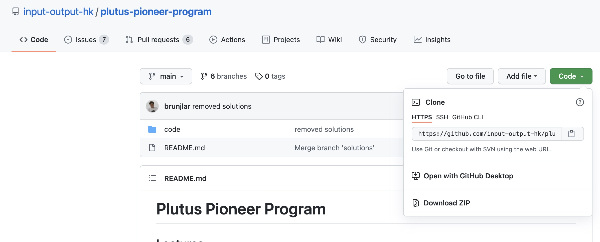

# Git: A Brief Introduction

> "My name is Linus Torvalds and I am your god."  
> — Linus Torvalds

*Note: Although Linus did put a lot of work into creating one of the most widely adopted, open source operating systems to date. To his credit, he doesn't actually take much of it when discussing his contribution to the development of git<a href="#fn1">1</a>.*

For more *interesting* quotes by Linus, see [this wiki page](https://en.wikiquote.org/wiki/Linus_Torvalds).

### 1. Introduction

This document is meant to be a very brief introduction to git, specifically how to use git in combination with the [Plutus Pioneer Course]() [[1]](https://testnets.cardano.org/en/plutus-pioneer-program/). For super advanced techno(logical) vikings, I will include some links to additional references at the end (or perhaps a forum where you can go to argue about things would be more appropriate, and more inline with what I like to call: 'the Linus style' *— tongue-in-cheek*).

### 2. What Is Git?

Firstly, I think there is often a misunderstanding in relation to what Git actually is. It is important to recognise that **(at the very least)** Git and GitHub are two different things. The same comparison can be made between Git and BitBucket or *(to a lesser extent)* Git and GitLab.

To provide a quick explanation, Git is a set of algorithms and data structures that allows for peer-to-peer software development and collaboration. It is a way of sharing a software project amongst many people who can contribute to it. 

*An interesting thought experiment for anyone new to Git and open source software development: how can we stop malicious actors from introducing bugs and backdoors into software for their own personal gain?)*

It is interesting to note that whilst Git was developed in the mid 2000s - it does use what is essentially a Blockchain (or at the very least a 'linked-list-esque' data structure, which is similar to a Blockchain) to manage software projects. Whilst, GitHub (and other similar services) are platforms which host a Git repository (for all intents and purposes, you can think of a repo as the ledger, but in the simplest terms, it's the codebase) for you. These services are centralised, but it should be noted that you can maintain a git repo (project) through the use of peer-to-peer network communication.

At this juncture, it seems appropriate to make a comparison between distributed ledger systems, blockchain consensus algorithms and Git. Git is essentially a distributed ledger, everybody should have (if they have pulled down the latest code) the same copy of the codebase. However, the primary difference here is that there is an incredibly low probability of Byzantine actors [[2]](#2) due to the implementation of the peer-to-peer web of trust model [[3]](#3).

### 2.1 The Web Of Trust Model 

Instead of having to deal with a distributed system where the Byzantines Generals Problem [[2]](#2) is a very real threat, you may modify 'the system' to use an alternative security model that minimises threat (the system itself may not require a large degree of security considerations, although I wouldn't ever make that assumption).

In this case, you only allow access to the codebase to immediate trusted parties (say, you have six developers who you know you can trust), in turn they also have their own trusted parties. Since nobody really has anything to gain from acting maliciously (within a *potentially* trusted group of individuals — *never underestimate the power of human incompetency*), the probability of a Byzantine actor tends towards zero. Thus, Byzantine Fault Tolerance [[2]](#2) isn't something you really have to worry about. Therefore, it follows that consensus (everybody has the same copy of the codebase) is quite easily reached without the use of immediate monetary incentives.

*Note: since this document is contained within a repository about, for lack of a better word, cryptocurrencies, it seemed appropriate to draw some correlations between Git and DLTs + Blockchain Consensus Algorithms.*

### 3. The Typical Case

The way in which open source projects (and private projects ran by private companies) are *typically* developed is through the use of a service such as GitHub. Open source software is available to view by anyone and, for the most part, anybody can contribute (subject to review and the project maintainers acceptance). The process of contributing to an open source project requires some prerequisite knowledge of how Git works, which we cover get into in [§5.8](#s58). Private companies keep their proprietary code restricted, for obvious reasons<a href="#fn2">2</a>, thus 

*Continue Writing This At A Later Date...*

### 4. Basic Git Commands and Repositories

During this section we're gong to run through the very basics of git. Firstly, how to configure a basic git user, downloading (cloning) repositories and finding out who has changed what.

#### 4.1 Git: Simple Configuration

When you contribute to any project, whether it is open source or closed source, it's always important (and polite) to let people know who you actually are. This can be accomplished by specifying she settings (your name and your e-mail address) within the console. We do this using the following commands:

1. <code>git config --global user.name "Jonathon Dilworth"</code>
2. <code>git config --global user.email "jon@dilworth.dev"</code>

*Note: the addition of the --global flag will set these values for any commits you push, on any project. To keep it project specific, simply remove the --global flag.*

[Read More Here](https://git-scm.com/book/en/v2/Customizing-Git-Git-Configuration)

#### 4.2 Git: Clone

When you copy an open source Git repository from a centralised service such as GitHub, you won't need explicit access<a href="#fn3">3</a> to the repository. You simply navigate to the repo, look for the green button that says: 'clone', select it (it is a drop down, of sorts) and use either HTTPS or SSH. If in doubt, HTTPS should work just fine. Copy the address provided for you by the drop down window, open your favourite console, navigate to where you want to clone the repo and enter:

<code>git clone https://github.com/input-output-hk/plutus-pioneer-program.git</code>

All should go well and you should now have a file called: plutus-pioneer-program within your chosen directory. **Welcome to the Plutus Pioneer team**.

[Read More Here](https://git-scm.com/docs/git-clone)

#### 4.3 Git: Log

Configuration variables, such as the one above are extremely useful because sometimes you'll find that you may need to know who pushed a specific commit. This is possible by running <code>git log</code> within the repository directory.

As you can see from the image below, this provides you with the commit hash (which we'll learn more about in [§5.4]()) some information about the branch the author has been operating on [[§5.6]()], the author name and e-mail, the date and the commit message.

This is helpful because it allows us to easily track who made certain changes.

[Read More Here](https://git-scm.com/docs/git-log)

### 5. What Is A Repository?

Up until this point, it has been assumed that you understand the basic concept of a repository (often referred to as a repo). However, there is a little more to a repository than may meet the eye.

It just looks like any other file right? Except it has some fairly special properties (hidden .git folder[s]) which allow for useful functionality. For example, the pointer that references the current 'instance of code' (commit) you are working from is stored within these types of folder. You don't really need to know the ins and outs of what resides within a .git folder (or, if you do, you're reading the wrong piece of documentation, this is intended for absolute beginners). It's just important you know these things exist and that it's essentially how git is able to implement functionality that you would expect from a version control system (VCS).

If you wanted to just stick with **really basic**, a repository is essentially just a folder that contains shared code, that you can collectively modify under a set of constraints.

[Read More Here](https://git-scm.com/)

#### 5.1 Data Structures

#### 5.2 Git: Pull

[Read More Here]()

#### 5.3 Git: Add

[Read More Here](https://git-scm.com/docs/git-add)

#### 5.4 Git: Commit

[Read More Here](https://git-scm.com/docs/git-commit)

#### 5.5 Git: Push

[Read More Here](https://git-scm.com/docs/git-push)

#### 5.6 Git: Branch

[Read More Here](https://git-scm.com/docs/git-branch)

#### 5.7 Git: Checkout

[Read More Here](https://git-scm.com/docs/git-checkout)

#### 5.8 Git: Extra

* [Merging Branches]()
* [Opening Pull Requests](https://docs.github.com/en/github/collaborating-with-pull-requests/proposing-changes-to-your-work-with-pull-requests/about-pull-requests)
* [Detached Head]()
* [Additional Further Reading]()

### 6. Using Git With The Plutus Pioneer Project

*Continue Writing This At A Later Date.*

### 7. Conclusions

*Continue Writing This At A Later Date.*

### 8. Further Reading

*Continue Writing This At A Later Date.*

### References

<a href="#1" id="1">[1]</a> 
The Cardano Group, ADA. (2021). 
Plutus Pioneer Pprogram by IOHK. 
Available at: <https://testnets.cardano.org/en/plutus-pioneer-program/>  
Accessed: 10/08/2021

<a href="#2" id="2">[2]</a> 
Lamport, L., Shostak, R. and Pease, M., 2019. 
The Byzantine generals problem. 
In Concurrency: the Works of Leslie Lamport (pp. 203-226).  

<a href="#3" id="3">[3]</a> 
Baltakatei. (2020). StackExchange.  
The Web Of Trust Model. 
Available at: <https://crypto.stackexchange.com/questions/80629/what-is-the-pgp-web-of-trust-strongset/>  

### Footnotes

<a href="#fn1" id="fn1">1.</a> Believe it or not, Linus can be quite humble! See the below quotes. 

> "I maintained Git for six months, no more, ... The real credit goes to others. I'll take credit for the design."  
> — Linus Torvalds, Open Source Summit Europe

> I'd also like to point out that I've been doing git now for slightly over two years, but while I started it, and I made all the initial coding and design, it's actually been maintained by a much more pleasant person, Junio Hamano, for the last year and half, and he's really the person who actually made it more approachable for mere mortals. Early versions of git did require certain amount of brainpower to really wrap your mind around. It's got much much easier since. There's obviously the way I always do everything is I try to do everybody else to do as much as possible so I can sit back and sip my Piña Colada, so there has been a lot of other people involved, too.  
> — Linus Torvalds, Tech Talk: Linus Torvalds on Git at Google

You can watch the Tech Talk [Here](http://www.youtube.com/watch?v=4XpnKHJAok8).