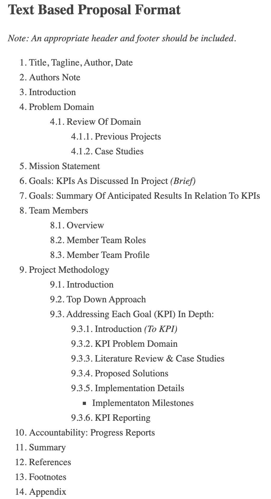

### 0-Project-Url

I only bought the domains a few days ago! I was REALLY annoyed that Babbage.io or .org or whatever wasn't available.

I bought:

* vaucanso.io
* vaucanso.org
* oracles.stream
* txid.stream
* eutxo.tools

The image as part of our current working proposal:

Writing Structure for proposal:

We're preparing a PDF but it'll take a few days.

I do have an implementation of a very basic NFT marketplace, currently it's pretty much just a chopped up blade template running on Laravel, so that's not really worth sharing.

#### Summary

Right now, until this course is finished, I'm going to be spending most of my time working on the pioneer program (which means: helping other people and writing notes @ https://github.com/jonathondilworth/detailed-plutus-lecture-notes - I mean I can not sleep tonight and make a start on another project? Sleep is overrated! I mean, you can check the dates on the purchase of those domains, it was literally, I think, 2 days ago.