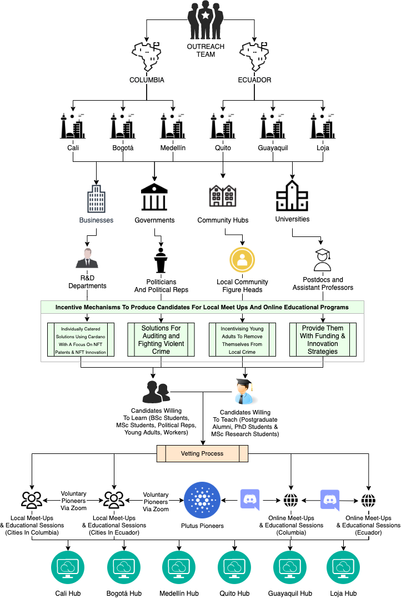

### 1. Authors Note

*You always write this last.*

### 2. Introduction

*You always write this last.*

### 3. Problem Domain

Within the Cardano community, there are many problems1. However, the specific issue identified within this project proposal focuses on the lack of community hubs within any given locality.

This section explores specific information surrounding the project's problem domain, along with possible domain extensions. In addition, a presentation of (domain-specific) project constraints are listed and a literature review is provided.

#### 3.1 Defining The Problem Domain

* Cardano is not globally recognised.
* Except for the ongoing projects in Africa, primarily English-speaking people with western values deem Cardano attractive.
* Adoption within our community is typically found online rather than from individuals on the ground interacting with their local communities.
* It is not easy to establish a global ecosystem when building Cardano-based communities in person, physically.
* Genuinely raising awareness, adoption and application development on the Cardano platform whilst also changing the lives of those involved is complex.

#### 3.2 Extensions To The Problem Domain

* Scams are rife within the Cryptocurrency community leading to real problems for real people.

*We want to create Cardano Community Hubs in South American countries to raise awareness (and education) of Cardano, onboard more users (and developers) and provide opportunity to those who wouldn't otherwise have it. It's difficult to raise awareness and adoption when accessibility to good infrastructure, development platforms and educational programs within native languages and cultures do not exist. The lack of awareness and access to good educational programs costs millions of dollars every month to Cardano users in these areas, as is demonstrated by the video Charles Hoskinson posted on his YouTube channel on the 18th of AUG, 2021. [[1]](#1)*

#### 3.3 Domain-Specific Project Constraints

* Resources (People and Funding)
* Language Barriers
* Cultural Barriers
* Organisational Corruption
* Accessibility To Reliable Infrastructure
* Accessibility To Capable Development Platforms
* Accessibility To Good Education In Native Languages Embedded In Native Culture

#### 3.4 Domain-Specific Literature Review

**Potential for Technological Adoption and Growth In Columbia**

Even though Columbia has a fairly low 'Per Capita Income' in USD, the ability for the country to change (with respect to efficiency, which is a function of technology and thus, technological adoption) is high when compared with neighbouring countries such as Peru [[2]](#2). Furthermore, Columbia provides metropolitan environments, allowing for better public infrastructure such as transport, communication, power and finance. It is shown that these qualities help to facilitate growth dynamism in technological hubs (within developing countries) [[3]](#3).

**Top Down Approaches To Technological Adoption**

**Selecting Localities For Technological Adoption**

**Effectiveness of Distance Learning**

*Continue Writing Literature Review*

### 4. Project Related Research Questions

*Insert related research questions here...*

### 5. Project Solution Space

This project's solution space is huge. The primary objective of this project is to produce new Cardano hubs within regions where Cardano is not hugely recognised or adopted. Depending on how you define a hub, solutions range from:

* Online Approaches
* Offline Approaches
* Top Down Project Design
* Bottom Up Project Design
* Novel Strategies That Involve A Hybrid Approach And, Or Design

*(to name but a few)*

#### 5.1 Our Definition Of A Cardano Community Hub

In general, hubs should help to inspire individuals to engage within a set of new passions and hobbies (with a primary focus on Cardano and Cryptocurrency). These hubs are for individuals who wouldn't normally have this opportunity. Furthermore, these individuals will realise such hobbies can be financially rewarding. It is our hope that by demonstrating their new found passions to local businesses (with the intent of obtaining employment) will help to improve their lives.

**Cardano Community Hubs Should:**

* Inspire individuals to learn about new technology, with a focus on Cardano.
* Empower individuals to obtain new skills related to development on the Cardano platform.
* Increase the degree of financial prosperity within the locality through the utilisation of the Cardano platform (DApp and Smart Contract development).
* Provide a larger degree of autonomy within everyday life for citizens within the locality.

A list of constraints that constitutes a hub can be found below.

**Hub Definition Constraint 1:**

A group of individuals who are actively participating in discussions surrounding cryptocurrencies in general, with a focus on Cardano. These are discussions we would hope people were having without any kind of supervision or teacher present. Furthermore, these discussions could be online or at a local meet up.

**Hub Definition Constraint 2:**

Local meet up sessions are regularly5 held by a pool of vetted individuals for the purposes of group discussion regarding cryptocurrencies, with a focus on Cardano.

**Hub Definition Constraint 3:**

Online educational programs have been developed by postdocs, assistant professors, PhD students and MSc Research students (in conjunction with voluntary participants from the Plutus Pioneer Program). The regularity of such educational programs should be decided by the hubs own governance mechanisms.

**Hub Definition Constraint 4:**

During the six month period, each hub is required to demonstrate a degree of growth yet to be decided.

**Optional Hub Constraint 5:**

Occasional campus meet-ups for university students if possible.

**A Stable Hub:**

A hub is deemed stable on any given day if all non-optional constraints are satisfied within a 24 hour period. For any given hub, the number of stable days is summated every two weeks. The number of stable days is then divided by the total number of days since the beginning of the project and is then multiplied by 100 to give a percentage. If, and only if the resulting percentage is greater than 51%, then a hub is deemed to be stable.

**Further Hub Considerations:**

* What thresholds should be set to measure the probability of a self-sustaining state?
* What thresholds should be set to measure the probability of a self-perpetuating state?
* What does a successful project mean to us?

#### 5.2 Project Solution Selection

Without a huge amount of resources, developing a global ecosystem for Cardano (using human resources on the ground) is incredibly difficult2. For this reason, a novel model based off top-down project design that implements a hybrid online and offline approach is proposed. The primary details of which are outlined within the next subsection. The in-depth implementation details can be found within the next section.

#### 5.3 Proposed Solution

*Academically Named: A Top Down Self-Perpetuating Model For Facilitating Social Interaction*

1. Develop A Strategy3 That Drives Self-Perpetuating Cardano Hub Creation Within A Given Locality
2. Implement Our Strategy Within A Selected Region
	* Select Countries Within That Region
	* Select Cities Within That Region
3. Execute The Project Methodology
4. Measure Results Based On Key Performance Indicators
5. Adapt Our Strategy If Necessary
6. Report Results Every Two Weeks To The Community
7. Report Final Results After Six Months
8. Produce A Paper Such That Others Can Reimplement Our Model In Other Localities

### 6. Solution Implementation

*To Be Written*

#### 6.1 Solution Introduction

*To Be Written*

#### 6.2 Approach

The decision to use a top down approach has been made due to issues surrounding language barriers and cultural barriers (as outlined as constraints within the problem domain in §3.3). Through the use of a top down project design, we will target specific individuals within large organisations that we can then incentivise to create pools of potential Cardano teachers and students. Once the candidates have passed the vetting process (security and safety measures) they can link up with other pools at other hubs, creating a regional network. Furthermore, they can participate in challenges organised for (and by) Plutus Pioneers. We would also like to ask IOHK to create a Discord channel that allows collaboration between each new Cardano Community Hub and the set of all Plutus Pioneers. This approach represents an initial expansion of the Cardano Community and specifies a model that may be reproduced in other regions, leading to global community.

#### 6.3 Solution Model Design

Due to the aforementioned constraints (outlined in §3.3), we felt that the typical bottom up approach of creating meet-up groups was simply incompatible. Therefore we produce a top down game theoretic 'self-perpetuating' adoption model. The model can be described as top down, as we're targeting domains that decrease in granularity the further through the topology you get. Furthermore, we describe our model as game-theoretic because it utilises a set of incentive mechanisms to produce our pool of potential candidates. Thereafter, the interconnectivity between each eventual pool, in addition to their connection to our pioneers and our community at large will help maintain retention. When new developers and community members obtain a larger degree of awareness and education through the Cardano Community Hubs, we anticipate that they will experience a degree of improvement in relation to their financial status and potential for a larger degree of autonomy within their lifestyles. These positive effects will result in a self-perpetuating model, hence, that is how we have defined our solution.

#### 6.4 Implementation Details

* We have one of our outreach team members heading to South America on the first of September to start collecting key information on the ground, whilst the other remains in the United Kingdom for a short period of time to continue remote research.
* Once we have built a directory of key individuals (high value targets) within businesses, governments, community hub and universities we will concentrate our efforts on one city per month.
* For the first week of each month we will be executing the incentive mechanisms to produce candidate pools for local meet-up and online educational programs.
* During the second week we will carefully vet the candidate pools and begin teacher and student selection.
* During the third week, meet-up and educational programs will start.
* The forth week provides a window of opportunity that allows pools to connect with one another and to the community at large.

#### 6.5 Addressing Key Performance Indicators

The measurement of true success is defined within the project brief. The following five KPIs is how project success will be scientifically measured.

##### 6.5.1 How many new Hubs were launched in the next 6 months?

Hubs can be stable or unstable, as is defined within §5.1. For the purposes of this project, this KPI has been translated to:

> How many new Hubs remained stable during project execution?

We would also like to establish firm constraints that demonstrate whether a Cardano Community Hub is in one of the following states:

1. Degeneration
2. Self-Sustaining
3. Self-Perpetuating

**If the Stability of a Hub is:**

* Less than 51% then it is unstable.
* Greater than 51% then it is acceptable as stable.
* Greater than 76% then it is on target (yet to be decided: and self-sustaining)
* Greater than 85% then it is high performing (yet to be decided: and self-perpetuating)

**Aims:**

* We aim to have at least three stable hubs within six months.
* We hope to have six stable hubs within six months.
* We aim to have at least one high performing hub.
* We aim to have as many hubs as possible rated as 'on-target'.

Within six months, we aim to have between three and six new Cardano Community Hubs within South America, split between two countries and six cities (and/or large towns).

##### 6.5.2 How many developers did this community-focused challenge bring into the Cardano ecosystem?

We intend on having multiple projects to suggest and we encourage (and incentivise through project registration on our portal) new developers to build their own projects. We will measure the number of new developers via git commits and registrations to our portal.

**Aims:**

* Obtain as many new developers as possible.
* Encourage new developers to get involved with projects along side Plutus Pioneers.
* Encourage Plutus Pioneers to volunteer to mentor new developers.

##### 6.5.3 How many new users of Cardano were onboarded?

Measuring new Cardano users is important, but we also believe measuring the retention rate of new users is just as important. Thus, for every new user that is onboarded, we will drop an NFT into their wallet on a random day every two weeks. A lottery script address will exist that the user can deposit their NFT into and at the end of the two week period the lottery will distribute a yet to be decided amount of ADA amongst the entries according to a yet to be decided distribution.

We add the following constraint: the NFT is only deposit-able for seven days after it has been minted, this incentivises the user to deposit the NFT to the burn address as soon as possible.

We then assume that the count of all transactions to that address represents a fairly good approximation to the number of retained Cardano users. Since we also know the number of new onboarded users, we will continually adjust our strategy to maximise retention. If there is time, we may try to model this.

These statistics will be reported back to the community every two weeks.

**Aims:**

* Onboard as many new users as possible.

##### 6.5.4 What was the total reach of the Hub's initial marketing launch?

*This is something we are still working on, we're in conversation with a number of marketing individuals.*

**Aims:**

* Currently, we're uncertain.

##### 6.5.5 How many external organisations did this community-focused challenge bring into the Cardano ecosystem?

This will be reported within our bi-weekly reports.

**Aims:**

* Currently, we're uncertain.

### General Notes

Involves:

* Inspiring Individuals to Create Self Perpetuating Cardano Community Hubs Within The Region of South America.

* Aid to prevent societal degradation by instantiating a perpetual model1 that incentivises innovation, growth and improves the standard of living.

What do these hubs do?

* Incentivise underpaid workers to learn new skills.
* Attempt to increase the degree of prosperity within the locality of each hub.
* Allow collaboration between interested parties, in addition to incentivising and inspiring innovation.
 
How would each hub be self-sustaining?

* Encourage the development of open source software, thereby naturally extending the community [1].

* [Through Open Source, You Obtain Natural Growth](https://youtu.be/dmfDaxYhi9I?t=692)

How do you know your model works?

* Currently, we are basing our model on use cases and using a hybrid approach through utilising the best advise we've been given. We have reached out to other charities, members of IOHK and the community at large to obtain as much feedback as possible, which has been, for the most part positive.

* Furthermore, we would continually iterate on our proposed methodologies in order to maximise performance, as defined by the KPIs within the project briefing.

### References

<a href="#1" id="1">[1]</a> Charles Hoskinson, 2021.  
Scams Within The Cryptocurrency Space.  
Published As A Youtube Video: <https://youtu.be/NKTnM5WzCBA>

<a href="#2" id="2">[2]</a> Taskin, F. and Zaim, O., 1997.  
Catching-up and innovation in high-and low-income countries.  
Economics letters, 54(1), pp.93-100.

<a href="#3" id="3">[3]</a> Vijayabaskar, M. and Krishnaswamy, G., 2004.  
Understanding Growth Dynamism and its Constraints in High Technology Clusters in Developing Countries: A Study of Bangalore, Southern India,“.  
Innovation, Learning, and Technological Dynamism of Developing Countries, United Nations Press, New York, pp.178-201.

### Footnotes

You would need people in every country trying to generate awareness and adoption of Cardano.