# 1. Lecture One: Introduction

Within this set of notes the following information will be presented. Firstly, the courses administration details are provied. Secondly, a coverage of the course content is outlined. Shortly thereafter, details about Plutus, the difficulty of the program and the (pseudo-optional) pre-requisites are given. Furthermore, an extensive explaination of the (E)UTxO model (which facilitates the possibility of transactions on the Cardano network - **Cardanos unqiue accounting model**) is fully explained. In addition, building an example contract is presented, which includes how to setup a NIX shell, how to start plutus-playground-server and enable it to be locally accessible from the browser. Smart Contract compilation is demonstrated and an example of how to use the plutus platform in whole is shown. As pioneers we are then encouraged to try this ourselves.

*Note: this document contains information pulled in from the Plutus Pioneer Lecture series in addition to information provided by reliable sources, such as videos, papers and statements made by employees of IOHK. Furthermore, to provide some background information on models such as UTxO (unextended), other academic sources (papers and books) have also been referenced.*

## 1.1 Administration

- Lectures on every Thursday.
- Q&A Sessions Every Tuesday.
- Oaccional Guest Lectures.
- Use the Discord server (and slack) to help one another when possible.

## 1.2 Course Coverage

**The Plutus Platform:**

- Smart Contacts on Cardano via (E)UTxO
- Writing Smart Contracts with Haskell (Local, Production)
- Compiling Haskell to Plutus-core using Plutus-Tx
- Details Surrounding Plutus-core (GHC Plug-in)
- Plutus-Tx Compiling Details (GHC Core): Intermediary Languages / Intermediary Representations

**Further Underlying Concepts**

**Smart Contracts In Detail (and their various forms)**

**Testing and Implementing Smart Contracts**

- Using the Plutus Playground
- Offline Locally

**Native Tokens On Cardano**

- Minting Native Tokens
- Burning Native Tokens
- Use of Native Tokens Within Smart Contracts

**Deploying Plutus Contracts**

**Writing Backends for Plutus Contracts**

## 1.3 Plutus Platform

> "Plutus Platform Learning is Difficult" - Lars Brünjes

*Why So Difficult?*

* Using (E)UTxO Model - Less intuitive than other similar technological implementations (E.G. ETH Accounting Model).
* Plutus is brand new and under rapid development, thus is changing all the time.
* Due to constant changes, we're required to regularly update project dependencies.
* Tooling is not ideal...
* Difficult To Access Syntax & Repl Docs.
* Difficult to Build Plutus (It's likely best to use NIX)
* The Docker Image for the Plutus Platform is not yet ready.
* Plutus-core is compiled down from Haskell, Haskell is fairly difficult.
* It is reccomended that you spend 40 hours per week, for 10 weeks to gain a solid understanding of Haskell before or whilst undertaing this course.
* Plutus is BRAND new - we are the first people **ever in the world to write plutus code**.
* This means: no quick answers from stackoverflow or google...

However,

* Haskell courses and documentation has been made available to help pioneers learn.

# 2. The (E)UTxO Model

> “Any fool can know. The point is to understand.”
> — Albert Einstein [[1]](#1)

## 2.1 What is (E)UTxO?

(E)UTxO abbreviates: "Extended Unspent Transaction Output", but to understand the extended model, we must first examine the unextended model (UTxO, firstly implemented by BitCoin [[2]](#2)).
 
## 2.2 UTxO Explained

>"If you want to get money, you have to consume an output that is laying around and in turn you get more outputs."
> — Michael Peyton-Jones

*What are unspent transaction outputs? Simply put: They are outputs - which can be thought of as remaining financial change - from previous transactions on the Blockchain that are still currently 'unspent' - Imagine you go to a shop, you buy a drink, you give the shopkeeper a £20 note, and you are given £19 back in change. That £19 is an unspent transaction output from the original transaction of the purchase of a drink.*

UTxO is a model of accounting and is used to identify how much 'money' (in this case: a digital 'currency') any 'wallet' [1](#ft1) on a blockchain data structure contains within it [2](#ft2). Each wallet address on a permissionless blockchain such as BTC is associted to a set of cryptographic 'tools' which lock any funds (BTC, Digital Currency) that are tied to the above mentioned wallet. Spending funds (e.g. sending BTC from one wallet to another) equates to the transfer of ownership of BTC from one private key owner to another [[3]](#3). This is accomplished by signing a transaction with the initiators private key, which can only be confirmed by verifying the signature using the initators public key.

**It is important to note that you can only use complete UTxOs as input. So, if Alice has 100 BTC and wishes to send 10 BTC to bob, Alice creates a transaction which consumes 100 BTC as input and creates two outputs, 90 BTC (for Alice) and 10 BTC (for Bob). This is similar to the example mentioned above regarding the use of a £20 note.**

You would therefore think that the sum of all input for any give Tx must equal the output, such that:

However, this is not the case. Firstly, transaction fees must be considered. *Furthermore, on Cardano (that implements the (E)UTxO model, uses ADA and not BTC) native tokens have been rolled out. Thus, minting and burning of native tokens creates an imbalance between the cumulative inputs and resulting outputs of a transaction. However, this is content for later lecture (according to Lars).*

*Note: This is all accomplished through the use of a software wallets implementing transaction algorithms [3](#ft3). Furthermore, technically BTC does implement basic 'smart contracts', which is to say, the transactional algorithms may utilise BitCoin Script (which includes a validator for identifying addresses and a redeemer to unlock the ability to spend funds[[5]](5)). As far as I understand, BitCoin Script is essentially a wrapper for managing public-private key cryptographic implementation and unlocking funds to spend through the use of digital signatures [[6]](6).*

## 2.3 Advanced Transactions Using UTxO

The extended implementation of UTxO as proposed by IOHK, developed and implemented by Cardano is much more powerful than BitCoins UTxO model. However, there exists 'advanced' payment system elements implementated by 'basic' UTxO. It is important to understand how multiple unspent transaction outputs from different wallets (essentially: different owners of BTC) can combine their UTxOs together to create a transaction output to be sent to an individual address.

Consider the scenario where Bob has 60 BTC (in the form of two UTxOs: 50 BTC and 10 BTC) and Alice has 90 BTC in the form of a single UTxO. However, they wish to send 110 BTC to Tom. Alice must consume her (only) UTxO and Bob must consume both his UTxOs to meet the required amount to be sent to Tom (creating three transaction inputs from two owners with three unspent transaction outputs).

Within this 'simple advanced' transaction, the outputs generated by the initiated transaction ensures Tom recieves 110 BTC and all other parties (Alice and Bob) recieve their change by splitting the resulting output such that they recieve the following [[7]](7):

## 2.4 And God Said Let There Be (E)UTxO

Cardano implements an extended model of UTxO. The fundamentals remain the same. Thus, transactions are made up of numerous inputs, which themselves are unspent transaction outputs. However, there are some modifications to the model which are important. These modifcations allow for more general transactions through the use of arbitrary logic.

Firstly, Cardano implements addresses differently to other cryptocurrencies (blockchains and distributed ledger technologies). Instead of using a simple hash-based derived address (using a public key as input), addresses in Cardano are generated using a derivation scheme outlined [here](https://developers.cardano.org/docs/get-started/cardano-serialization-lib/generating-keys/).[4](#fn4) These addresses are referential in nature and point to scripts containing arbitrary logic. These scripts are programmes which are (ideally) deterministic, pure, replayable state-machines. Somewhat similar to the aforementioned $validators$, but are far more general in nature. They are, however, still used to determine whether a given UTxO may be consumed based on the $redeemer$ input, which is now also arbitray in nature and has replaced simple digital signature based input.

Secondly, transaction outputs also contains a component called $datum$ *(which is the singular noun for data)*. $Datum$ is useful for identifying state. This means that the (E)UTxO is at least as powerful as the ETH model.

**(E)UTxO Advantage: Validation of UTxO Off-Chain**

It is possible to check that a transaction will validate within your wallet before ever sending it to the chain.

**However, Simultaneous UTxO Consumption Is Possible**

Unspent transaction outputs can be consumed by others before your transaction has the oppurtunity to reach the chain (after beng verified by your wallet software). In this instance, your transaction will simply be dropped back into the pool of transactions to be verified (so long as all the inputs are still there) and attempts to verify your transaction will continue.

**Scope: (E)UTxO Model Scripts, Redeemers and Datam**

The implementation of scripts within the (E)UTxO model ensures that the scope is limited to the transaction (or a small chain or transactions) that are attempting to be facilitated by a user. This means the state of the entire blockchain does not need to be known (as is the case with ETH). Furthermore, there is an appropriate degree of scope that enables to ability to create smart contracts which are (ideally) deterministic in nature, meaning: the output is predictable. This makes it more difficult to introduce bugs into the software.

## 3. Plutus Platform, Smart Contracts & Nix

During the first week of this program, we have been asked to:

* Clone The Plutus Pioneer Repo
* Clone The Plutus Repo
* Build Plutus (Using Nix, Cabal, The Docker Image Is Not Yet Ready)
* Set Up The Plutus Binary Cache Appropriately (Otherwise It'll Take Forever To Build)
* Start A Nix-Shell
* Start The Plutus Playground Server Locally
* Run NPM To Allow Access To The Playground Via A Local Server
* Copy & Paste A Complicated Haskell Smart Contract Into The Playground
* Compile The Smart Contract
* Interface With The Smart Contract Via A Web Browser
* Apply Some Changes To The Contract
* Play Around With The Interface Via The Browser

## 3.1 Cloning Repos

I would hope that if you were enrolled in this program, you can skip this chapter. But, in the interest of being exhaustive the process of cloning the repos is outlined below.

I typically like to place all my projects within the following directory:

	~/code/.
	
Navigate and clone the appropriate projects from IOHK:

	cd ~/code/
	git clone git@github.com:input-output-hk/plutus-pioneer-program.git
	git clone git@github.com:input-output-hk/plutus.git

Congratulations, we're on your way to getting started!

## 3.2 Building Plutus | Installing Nix (MacOS) | Cabal | Nix-Shell

In order to build Plutus you're most likely going to need Nix (you can install Nix within a VM using nixOS, or you can install on MacOS or Windows. Be aware on MacOS you need xtools and potentially various other dependencies. Installing via Homebrew was suggested to me, but I found simply building the binaries easier.

Navigate to your home directory:

	cd ~/.
	
Download the latest version of Nix for MacOS and pipe into sh to start the install script:

	curl -L https://nixos.org/nix/install | sh

*Note: ensure you have root priv-access.*

Add the binary folder to your global PATH variable (note: I'm using zshell):

	sudo vim ~/.zshrc
	export PATH="$HOME/.nix-profile/bin:$PATH"
	
Ensure you're using the current Plutus build by checking the .cabal-project file in the current weeks code folder.

Ensure the Nix binary cache is setup:

	sudo vim /etc/nix/nix.conf
	substituters        = https://hydra.iohk.io https://iohk.cachix.org https://cache.nixos.org/
	trusted-public-keys = hydra.iohk.io:f/Ea+s+dFdN+3Y/G+FDgSq+a5NEWhJGzdjvKNGv0/EQ= iohk.cachix.org-1:DpRUyj7h7V830dp/

Check the current builds project hash, it's displayed via the 'tag', now checkout to that branch in the Plutus github repo and begin a nix-shell:

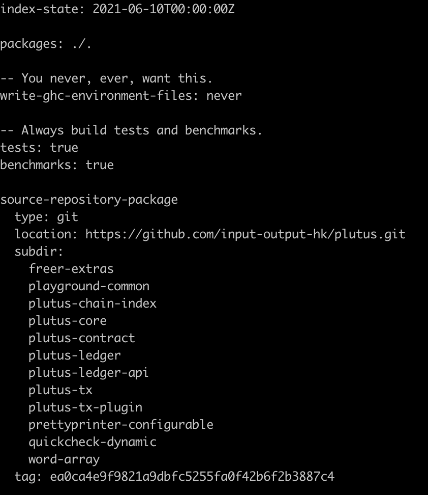

	cd ~/code/plutus-pioneer-program
	cd ~/code/plutus
	git checkout ea0ca4e9f9821a9dbfc5255fa0f42b6f2b3887c4
	
Change directory back to week one of the program and build the project using cabal:

	cd ~/code/plutus-pioneer-program
	cd code/week01
	cabal build

This may take some time, but be patient! When it's done, change directory to the plutus playground client folder and start the plutus playground server, open a new nix-shell and then npm start to be able to view the application in the browser:

	cd ~/code/plutus/plutus-playground-client
	plutus-playground-server
	// new shell window
	nix-shell
	cd ~/code/plutus/plutus-playground-client
	npm start
	
*This May Also Take Some Time...*

But, you should end up with something like this, where the playground is being hosted locally @ localhost, port 8009:

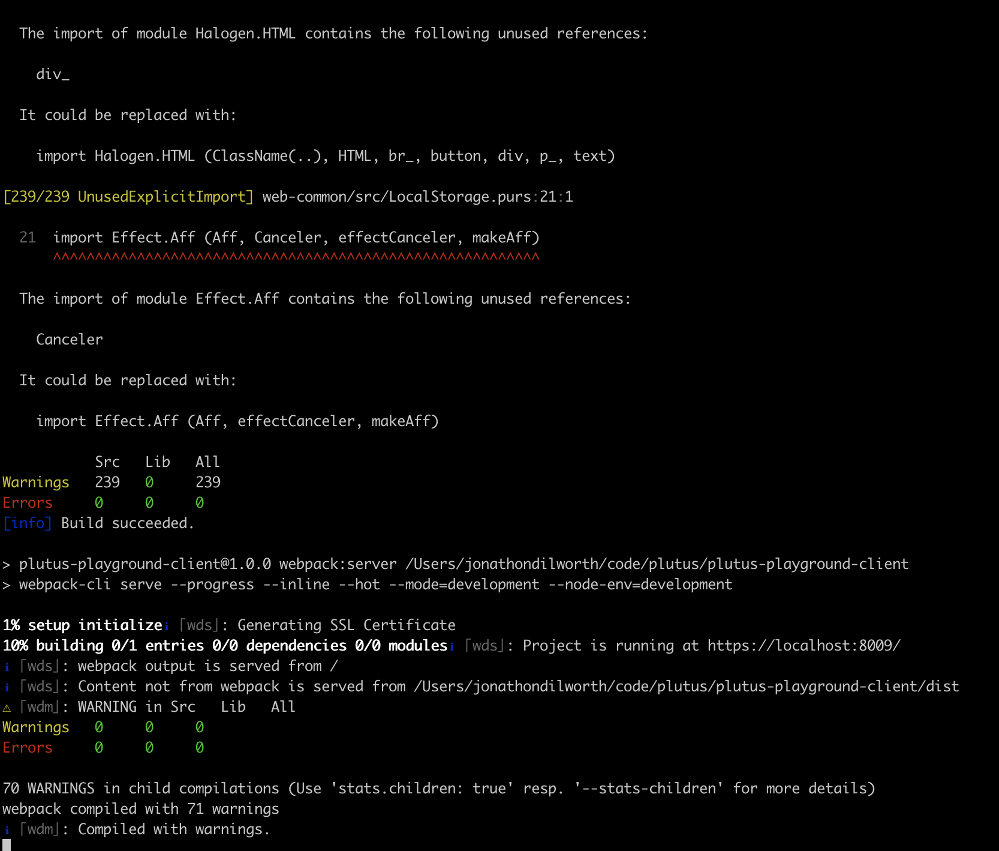

So, head on over to localhost @ port 8009 (http://localhost:8009). It looks so pretty! Doesn't it?

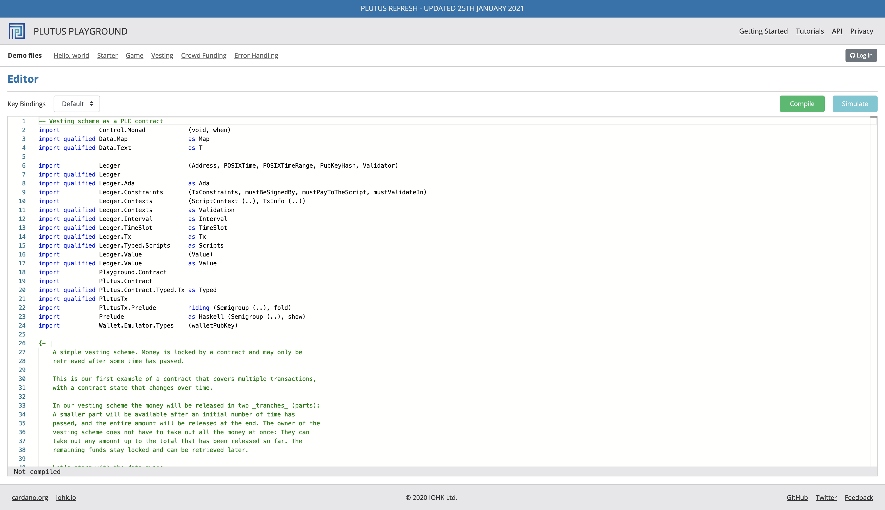

Hit compile, and then hit simulate. You should see the interface to the Haskell program running as a smart contract on the plutus pioneer playground server (locally), you should see (and play around with the following):

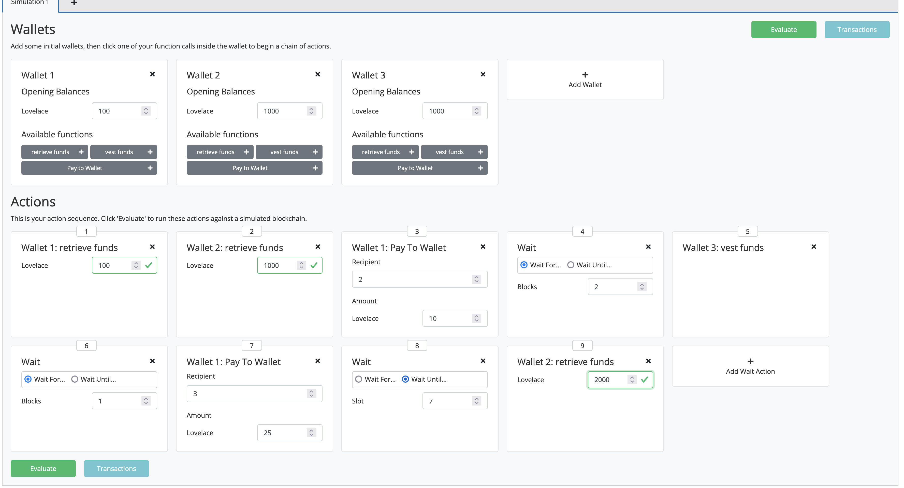

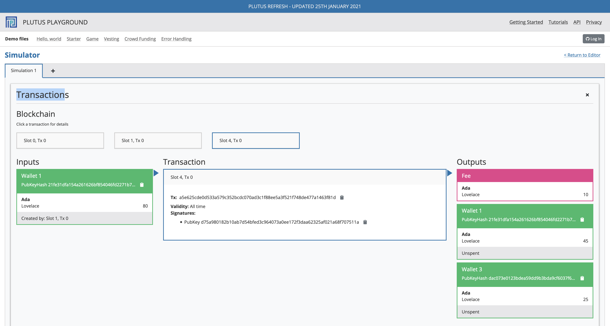

## 4. Exercise: Auction

During the first week of the Plutus program the only real 'homework' we were assigned was to get the playground up and running via Nix, mess about with it and simulate an NFT auction. This was all shown to us during the lecture, so it's pretty easy to follow.

1. Open a new nix-shell (in ~/code/plutus).
2. Change directory to ~/code/plutus-pioneer-program/code/week01
3. Run cabal repl
4. Now you can run handy commands such as: import Ledger.TimeSlot (as you'll need this) + others.

Now, you're going to need the EnglishAuction.hs script, which can be found @

	~/code/plutus-pioneer-program/code/week01/src/week01/EnglishAuction.hs
	
Copy and paste this into the Plutus Playground within your browser and hit compile. You should no be able to simulate something that looks like the following:

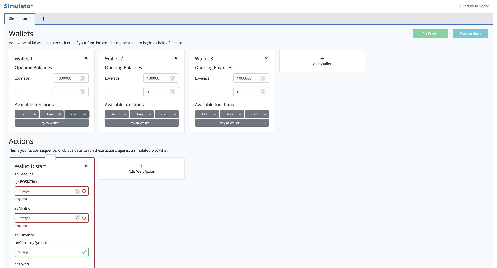

## 4.1 Simulating 

As an NFT auction, we're using the T parameter in the wallets to represent an NFT. Go ahead and add an additional wallet and add some ADA to them. Now, when you go to add the start of the auction, you'll require an expiry time. The problem is, time is measured in POSIXTime. However, you can open the repl and run the following:

	import Ledger.TimeSlot
	slotToPOSIXTime 10
	
This generates a time value for slot 10, as is shown below:

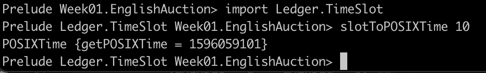

Now you can start filling in the auction that we're about to simulate (I used some random values for ADA, etc, so the number of my Txs may be different to yours, but typically you should have at least three or so, with the first being the genesis transaction, which fills individuals wallets:

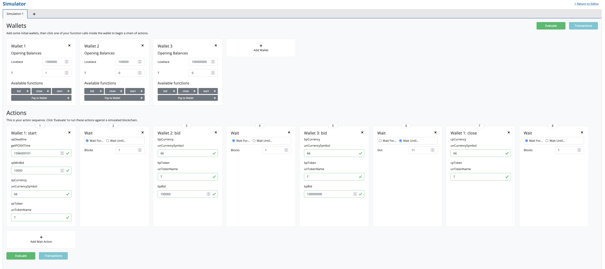

**Transaction, Slot Zero**

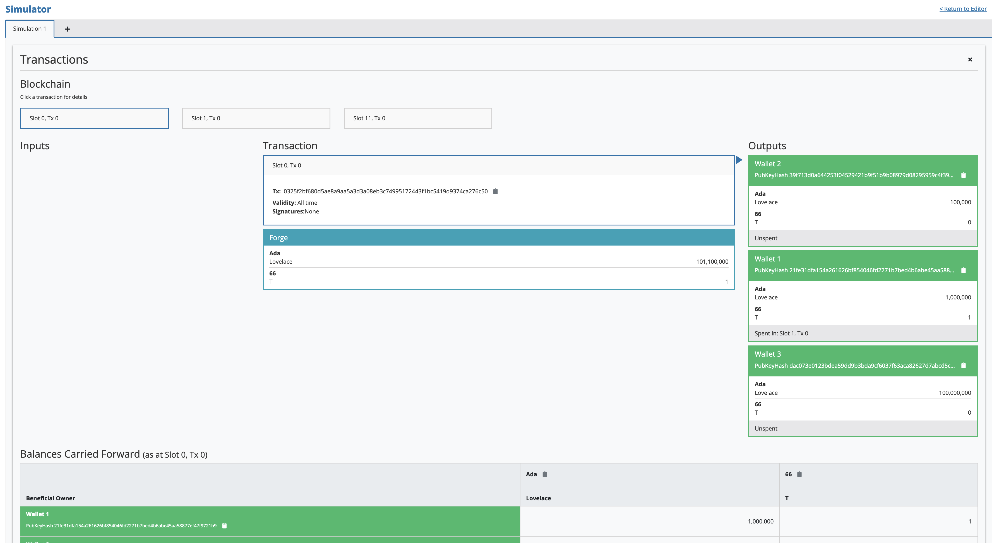

**Transaction, Slot One**

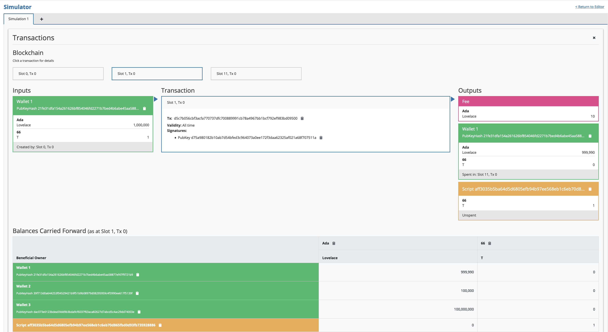

**Transaction, Slot Two**

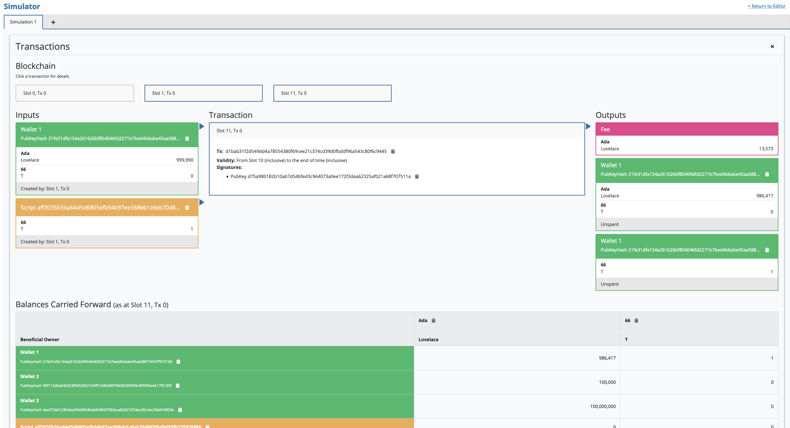

## 4.2 Simulation Issue (Resolved)

So, I noticed the NFT was not transfering from wallet one to wallet three. It turns out I hadn't put enough ADA into wallet three to bid for the NFT in addition to paying the transaction fee. All in all, good learning experience. See below:

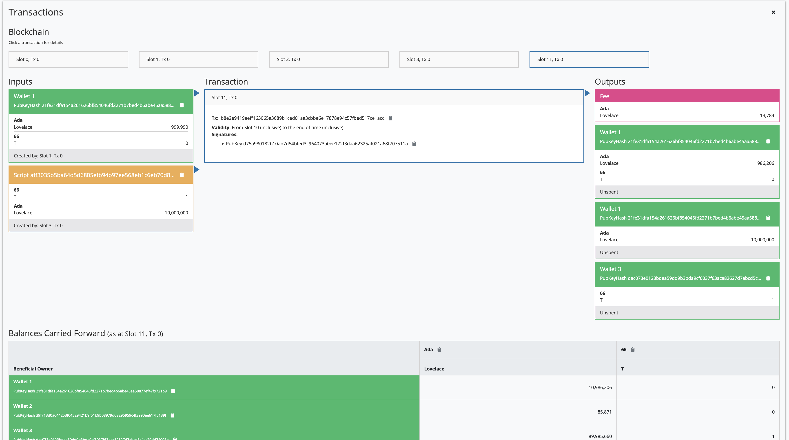

## 5. Possible Problems & Uncertainties

###### The Following Paragraphs are sections that I removed, as I wasn't 100% sure as to whether they were accurate or not.

Firstly, the $validator$ in Cardano is extended to also implement the aforementioned arbitrary logic and is no longer a simple transactional algorithm which returns a boolean value based on the input from the $redeemer$. Therefore, the $validator$ is a programmable.

Furthermore, the $validator$ ultimately remains unmodified (recall that the $validator$ determines the address of the transaction output. Thus, it's not a great idea to add too much complexity to the on-chain validation script).

*(From the video by Michael Peyton Jones)*

As you have most likely identified by now, the $validator$ is required to (rather self-evidently) validate the entire transaction on-chain. In order for it to perform this function, it must have the appropriate scope such that it can evaluate the entire context of the transaction. This is why an additional component is added to all Cardano transactions called $context$. The $validator$ can now see all inputs and ouputs for the transaction that it is validating and can be re-used within a chain of potential transactions. A chain of transactions can be thought of as a state machine.

*(Information on Context and State Machines which may be outdated? They were not in the first lecture)*

Secondly, transaction outputs also contains a component called $datum$ *(which is the singular noun for data)*. $Datum$ is useful for identifying state (this is important for the implementaton of state machines, as is explained in the next paragraph).

*(Again, this may be useful later, but it wasn't really present in the firt lecture, state machines that is)*

# References

<a id="1">[1]</a> 
Simmons, G.F., 2003. 
Precalculus mathematics in a nutshell: geometry, algebra, trigonometry. 
Wipf and Stock Publishers.

<a id="2">[2]</a> 
Antonopoulos, A.M., 2014.
Mastering Bitcoin: unlocking digital cryptocurrencies.
O'Reilly Media, Inc.

<a id="3">[3]</a> 
Nakamoto, S., 2008.
Bitcoin: A peer-to-peer electronic cash system.
Decentralized Business Review, p.21260.

<a id="4">[4]</a> 
Pardalos, P., Kotsireas, I., Guo, Y. and Knottenbelt, W., 2020.
Mathematical Research for Blockchain Economy.
Springer International Publishing.

<a id="5">[5]</a>
Zahnentferner, J. and HK, I.O., 2018.
An Abstract Model of UTxO-based Cryptocurrencies with Scripts.
IACR Cryptol. ePrint Arch., 2018, p.469.

<a id="5">[6]</a>
Pérez-Solà, C., Delgado-Segura, S., Navarro-Arribas, G. and Herrera-Joancomartí, J., 2019.
Double-spending prevention for bitcoin zero-confirmation transactions.
International Journal of Information Security, 18(4), pp.451-463.

<a id="6">[7]</a>
Antonopoulos, A.M., 2017.
Mastering Bitcoin: Programming the open blockchain.
O'Reilly Media, Inc.

# Footnotes

<a name="fn1">1</a>. The use of the word: wallet can be misleading (and this may be why UTxO models are not hugely intuitive). A wallet is simply the stored set of cryptographic 'elements' generated through the use of ECC Public-Private Key cryptograpy [[2]](#2) and hashing algorithms. In the case of BitCoin, a user generates a public-private key pair, and their 'wallet' address is generated using the following hashing algorithm: $ADDR = RIPEMD160(SHA256(K))$, where K represents their public key and is then shortened further using additional functions that you can read about [here](). These keys (or 'cryptograhic elements') are stored within their wallet, which, if they are managing themselves (and not through the use of a central exchange or central online wallet) are kept offline (and are always off-chain). However, wallet addresses (which are tied to a wallet computer program) are available on-chain (they have to be in order to initiate a Tx).

<a name="fn2">2</a>. Wallets can contain hundreds of public-private key pairs and the owner for X amount of BTC can in turn have hundreds of unspent transaction outputs. However, it must be noted that when such a user creates a new transaction, the set of their unspent transaction outputs will be used as inputs into the following transaction.

<a name="fn3">3</a>. Transaction algorithms such as: P2PKH: "Pay To Public Key Hash", P2PK: "Pay To Public Key", P2SH: "Pay To Script Hash", P2WPKH: "Pay To Witness Public Key Hash" [[4]](#4).

<a name="fn4">4</a>. You can view the implementation of addresses here: [https://github.com/input-output-hk/cardano-addresses/blob/master/core/lib/Cardano/Address.hs](https://github.com/input-output-hk/cardano-addresses/blob/master/core/lib/Cardano/Address.hs)