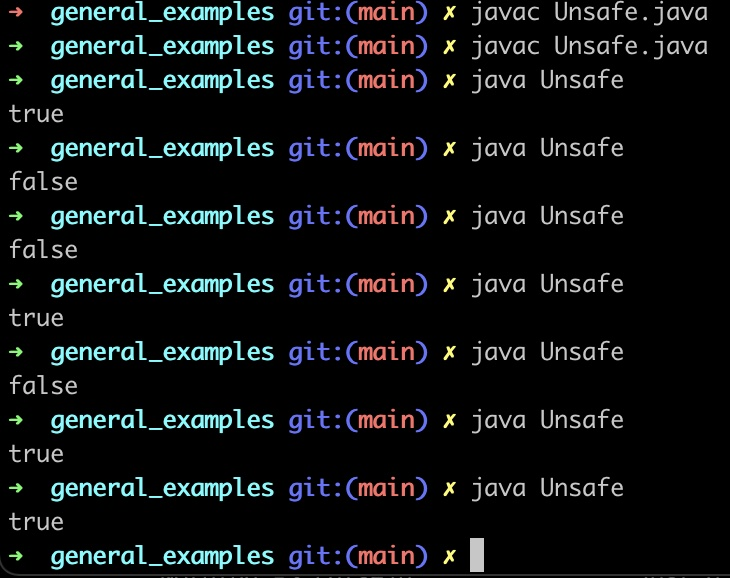
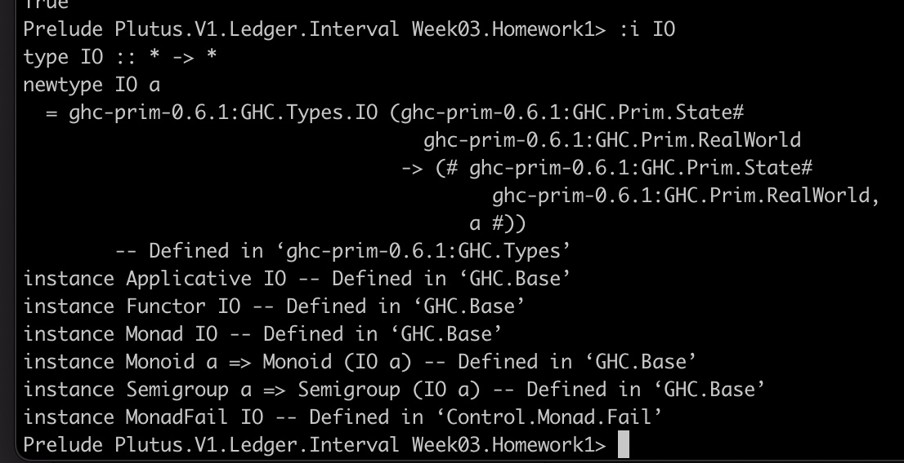
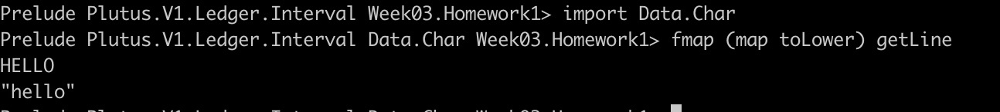
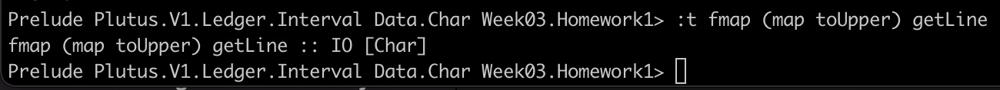
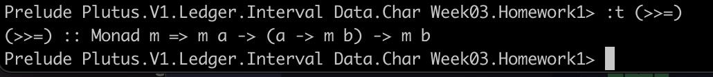
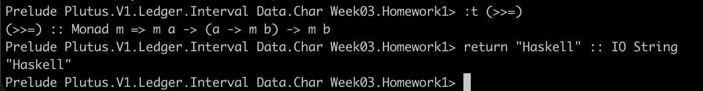

# Lecture Four

> “Unless you try to do something beyond what you have already mastered you will never grow.”  
> — Ralph Waldo Emerson

### 1. Introduction

*Currently Being Written...*

During this lecture, we're going to cover *a lot*. Firstly, we'll be briefly discussing the possibility and extent of on-chain arbitrary logic (even though this lecture focuses on a Haskell Primer and off-chain logic). So, we'll have a quick chat about: validation logic, plutus script, network nodes, context, IO and native tokens. When it comes to the meat and potatoes, the off-chain code and the Haskell primer... We're going to examine what monads are, specifically the contract monad, as implemented by the wallet. Furthermore, we'll review some off-chain checks / validation, then building the transactions themselves too (to be deployed to our own / nearest node). Oh yes, how did I forget. We'll also be discussing safe vs unsafe and useful vs non-useful. Lastly, IO (that stands for Input Output, just in case you didn't know) and the effects that can be had using Haskell IO.

### 2. An 'Advanced' Haskell Primer

As I have previously stated, I have done **some** Haskell during my undergraduate degree and then a refresher during my postgrad. However, it has been quite a while; and if I'm completely honest, I never wrote **that much**. I mean, when you compare the couple of hundred (potentially, I can't remember) lines of Haskell I wrote with the tens of thousands of lines of ARM assembly I was forced to write, well, it puts things in perspective. If anyone needs an ARM assembly guy, I'm your man.

**Some Important Points To Consider**

* According to Lars, Monads are very similar to burritos; and guess what, I **LOVE** burritos.
* Monads are usually the first stumbling block for people who are not use to Haskell.
* We're going to enter into Haskell **very gently within these notes**.
* Then, we'll provide a brief introduction to Monads.
* **HOWEVER...** Before we get to Haskell, let's look at (the dreaded) Java (Unsafe and Useful!)

### 2.1 Imagine: Mainstream A "Unsafe" "Useful" Language: Java

Firstly, when it comes to imperative programming<a href="#fn1">1</a> a single function may do one of many things<a href="#fn2">2</a>. In the world of 'Smart Contracts' which may be dealing with peoples' livelihoods and quite importantly, their money, it's a good idea to try and limit the amount of 'things' such a contract is able to do. Essentially, go and watch the Simon Peyton Jones video about safe and unsafe programming languages [[2]](2), it is somewhat tongue in cheek (at least, the title was at the time), but there is **a lot** of sense to it. Please see below for an example of an "unsafe" "useful" programming language.

**Java Example:**

<pre><code>import java.lang.Integer;

Public Static I makeSomethingHappen() {
	// ...
}
...
System.out.println(makeSomethingHappen();
...
makeSomethingHappen();
</code></pre>

Even though the above code will always return a value of type int, since we do not know what the ... executes (if it was not a comment, of course!), it may not always return the same <code>int</code> value. This is due to the fact that the Java program could be performing arbitrary input/output, it may depend on any number of, say: global variables, connections to a DB, API calls, etc. Essentially: it's unpredictable in nature. It's unsafe. But, it can be pretty useful (Thanks Simon!).

### 2.1.1 A More Concrete Unsafe (But Rather Non-Useful) Example

To demonstrate what we're talking about here more concretely, I wiped out my old Java book from about ten years ago and threw together the following code. Now, prepare to be disgusted, because Java programmers use notoriously long variable names. You could even say: the polar opposite of Haskell programmers (as most of them are mathematicians, so <code>x</code> seems to be perfectly adequate to provide a useful naming convention for mathematicians)! Anyway, see below *(and yes, Java is unnecessarily verbose)*.

<pre><code>import java.net.URL;
import java.net.HttpURLConnection;
import java.io.BufferedReader;
import java.io.InputStreamReader;
import java.lang.StringBuilder;
import java.net.MalformedURLException;
import java.io.IOException;
import java.util.regex.Pattern;
import java.util.regex.Matcher;

class Unsafe
{
	// Yes - code should be refactored, it's an example.
	/**
	 * Get the HTTP repsonse body (in string format) at a spec'd URL
	 * 
	 * Usually this would be refactored, but this is a simple example
	 * In addition, there are ample comments here, so.. do one.
	 * 
	 * @param fromUrl A string: HTTP endpoint
	 * @return        The contents at the fromUrl param
	 */
	public static String getSingleLineHttpResponse(String fromUrl)
	{
		// typical Java; x aint good enough we have to use long var names
		// the code should read such that it doesn't need comments
		// ref: Uncle Bob: Clean Code
		try
		{
			URL webAddress = new URL(fromUrl);
			HttpURLConnection webConnection = (HttpURLConnection) webAddress.openConnection();
			if(webConnection.getResponseCode() != 200)
			{
				throw new IOException("Error: Sorry, but the connection was unsuccessful.");
			}
			BufferedReader someMemReader = new BufferedReader(new InputStreamReader(webConnection.getInputStream()));
			return someMemReader.readLine();
		}
		catch(MalformedURLException malformedException)
		{
			return "Error: the supplied URL is malformed or.. BAD";
		}
		catch(IOException inputOutputException)
		{
			return "Error: the input resource is unavailable or.. BAD";
		}
	}

	/**
	 * Simply removes an expected value from square brackets
	 * ANY Exception returns -1
	 * 
	 * @param singularJSONInput	a singular line of JSON [...]
	 * @return a value between 1 and 100 or -1 on error
	 */
	public static int extractIntFromSquareBrackets(String singularJSONInput)
	{
		try
		{
			Pattern valuesWithinAnySquareBrackets = Pattern.compile("\\[(.*?)\\]");
			Matcher matches = valuesWithinAnySquareBrackets.matcher(singularJSONInput);
			String value = matches.find() ? matches.group(1) : "-1";
			return  Integer.parseInt(value);
		}
		catch(Exception e)
		{
			return -1;
		}
	}

	/**
	 * Gimmie' a 5! (of type int)
	 * 
	 * @return 		(int) 5
	 */
	public static int doSomething() 
	{
		return 5;
	}

	/**
	 * ...
	 * 
	 * @return If a random value between (1 : 100 + 5) > 54 then True else False
	 **/
	public static boolean doSomethingComplex()
	{
		String randomFromAPI = getSingleLineHttpResponse("http://www.randomnumberapi.com/api/v1.0/randomnumber");
		int randomNumberFromAPI = extractIntFromSquareBrackets(randomFromAPI);
		return ((randomNumberFromAPI + doSomething()) > 54);
	}

	/**
	 * The imperative, unsafe (but useful) program!
	 */ 
	public static void main(String[] args)
	{
		// Let the box heat up... can we know the result? NOPE.
		System.out.println(doSomethingComplex());
	}
}
</code></pre>

We can observe the (somewhat predictable) unpredictable output of this code (yes, it does compile).

><em>COFFEE TIME! You may remember me writing something about including 'coffee time' within some of my lecture notes, they're essentially exercises that I have thought about, that I might want YOU, the reader (if there are any) to think about.
>
> Question: Right, so we can all make out that this code will TYPICALLY return True or False, however, are there any other possible outcomes? What are they? Why might they occur?</em>

The point is: **arbitrary input output from any data source is possible anywhere within the programme, during execution**. The output coming from these sources may (and is very likely to) change, making it difficult to test. The further away we get from deterministic output (or, simply a small set of possible predictable outputs), the harder it becomes to test. When we're playing with money, **this is not a good thing!**

### 2.2 Now: For Some Haskell

So, you like the sound of declarative programming do you? **Good for you!** Personally, I am indifferent. I enjoy playing Snake on a Nokia 3310, but at the end of the day, you select the correct tool for the job. In my personal opinion (and I believe I can speak for the majority of the Cardano community here when I say): some kind of functional programming is the most appropriate tool when it comes to the implementation of smart contracts. Haskell is, as you well know, a functional programming language, so let's see an example.

**Haskell Example:**

<pre><code>foo :: int
foo = ...
	
let x = foo in ... x ... x ...
... foo ... foo
</code></pre>

*Note: Haskell is a pure functional language*

*Now I'm going to assume you also are clued up on your basic philosophy:*

Premise 1: Given that the value of calling <code>foo</code> is unknown, and  
Premise 2: Assuming foo has been assigned a return value<a href="#fn4">4</a>  
Conclusion: Then foo will **always**<a href="#fn5">5</a> return the same value [[1]](#1)  

**Haskell knows that you're not a liar, so it keeps you to your word! This is explained in §2.3 as referential transparency.**

### 2.3 Referential Transparency

The following is an extract from a very well known Haskell tutorial / book:

> In purely functional programming you don't tell the computer what to do as such but rather you tell it what stuff is. The factorial of a number is the product of all the numbers from 1 to that number, the sum of a list of numbers is the first number plus the sum of all the other numbers, and so on. You express that in the form of functions. You also can't set a variable to something and then set it to something else later. If you say that a is 5, you can't say it's something else later because you just said it was 5. What are you, some kind of liar? So in purely functional languages, a function has no side-effects. The only thing a function can do is calculate something and return it as a result. At first, this seems kind of limiting but it actually has some very nice consequences: if a function is called twice with the same parameters, it's guaranteed to return the same result. That's called referential transparency and not only does it allow the compiler to reason about the program's behaviour, but it also allows you to easily deduce (and even prove) that a function is correct and then build more complex functions by gluing simple functions together. [[1]](#1)

*Too Long Didn't Read?* Essentially, **referential transparency** is a property that does its best to maintain consistency in a value of an expression if the other components of the program **can change whilst maintaining** the value of such an expression.

### 2.4 Breaking Down The Haskell Example Some More...

> "The Hacker Way is an approach to building that involves continuous improvement and iteration. Hackers believe that something can always be better, and that nothing is ever complete."  
> — Mark Zuckerberg

*I Believe that's a perfectionist Mr Zuckerberg, haven't you ever encountered a manager before? They're of a polar opposite nature. Anyway, this section only exists because I forgot where I was during the lecture notes, so feel free to skip over it!*

##### Consider the following Haskell code:

<pre><code>1. foo :: Int
2. foo = ...
3. ...
4. foo
5. ...
6. foo
</pre></code>

To break it down outside of comments (since it's so simple):

1. initially we declare foo as type Int.
2. Then, we initialise foo to return a value of, let's say, 27 (for a laugh).
3. Right, so between lines 2. and 4. (Via the power of deduction: line 3!) some things happen... 
4. Now, **no matter what happened prior, when we call foo**<a href="#fn6">6</a> (on line 4 and 6), it will always return the same value. **That value is: 27 of type Int and this property is known as referential transparency** [§2.3](#rt23).

### 2.5 Some More Referential Transparency

As if we haven't covered enough. We're documenting everything here... Thus, consider the following.

<pre><code>1. let x = foo in ... x ... x ...
2. ... foo ... foo ...
</code></pre>

During the first line, we're declaring assigning foo to x. Shortly thereafter, we're referencing foo via x. Then on line 2, we're also calling foo (there are intervals of 'other-worldly' program behaviour between these statements); but, due to referential transparency, we can be certain that (assuming foo still equals the value we set it to return) foo and x are going to provide the same value.

### 3. Input Output: Haskell Finally Has An Effect On The World!

*Why do we write programs?*

*Why do programmers exist?*

**These are some of the most profound questions oneself can ask oneself.**

Presupposition: Programmers exist in order to write programs (primarily).
Premise 1: Programs must be useful.
Premise 2: For programs to be useful, they must effect the world.
Conclusion: only programs that can effect the world are useful.

> "Us geeky Haskell guys started with a completely useless language, in the end a program with no effect, there is no point in running it is there? You have this black box, you press go and it gets hot! There's no output, why did you run the program? The reason you run a program is to have an effect! But, nevertheless, we put up with that embarrassment for many years!" [[2]](#2)  
> — Simon Peyton Jones

**Finally!** We've managed to implement something in Haskell that **ACTUALLY DOES SOMETHNG!** How, you ask? Well, we use something called *the magic* of the **Type System**. Since Haskell is statically typed [[4]](#4) since every expression in Haskell must have a type. Thus, it is possible to create a type constructor (for the compiler) that indicates that the type that it pre-fixes is to construct input and/or output (IO) of the post-fixed type. For example: <code>hello :: IO String</code> and <code>world :: IO Int</code> are of different types. This is because the <code>IO</code> *type constructor* is of type <code>IO String</code> with respect to <code>hello</code>. However, <code>world</code> has the type constructor <code>IO int</code>.

### 4. Type Constructors

See the following IO Type Constructor.

	foobar :: IO Int
	foobar = ...
	
The IO type constructor is described as by Lars as a 'recipe' to compute an Int and this computation can invoke side effects. Lars insists that it does not break referential transparency, so I can only assume that by recipe he essentially means: some code exists, which may be impure. However, the code / behaviour of the program outside of this impurity (arbitrary IO) itself never changes. Thus, the only thing that can change is the actual Input (or/and Output, depending on what the function that uses IO does). It must therefore follow that referential transparency is not broken.

### 5. More Info! Plus Some Code!

**Consider the following code, for a moment:**

<pre><code>import Data.Char
main :: IO ()
main = do
        putStrLn "Hey! What's your name?"
        name <- getLine
        let bigName = map toUpper name
        putStrLn $ "hey " ++ bigName ++ ", how are you?!"
</code></pre>

**Now, let's get some stuff explained.**

* This above code is not being ran within a ghci.
* It's saved within a .hs (Haskell Extension) file.
* It's then being compiled using cabal <code>cabal run [SCRIPT_NAME].hs</code>.
* The reason for this is because is outlined within the [next subsection](#s31).
* I would like to remind you that Haskell is Beautiful and **Pure**.
* Unfortunately, IO introduces a degree of terribleness into a beautifully pure language. Thus rendering it potentially impure. However, this does now mean our computer doesn't just turn into a radiator for those cold December months! *The one thing Haskell actually use to be good for!*
* Pure functions may be parameterless or they may not be. We can, however, know (for certain) that they will **always** return the same value (given that a parameterised pure function is provided with the same parameter[s]).
* Impure functions *spoil everything!* They introduce indeterminism into what would otherwise be deterministic (insofar as we can control any values passed to parameterised functions).
* Impure functions **do not always return the same value.**
* Impure functions **can only be implemented within impure functions...** So, I suppose we have to thank God (or Simon Peyton Jones) that the <code>main</code> main function (which is executed when the script is ran after having been compiled) is itself... Impure!
* You cannot implement impure functions within pure functions. If you do, prepare yourself for 'a domestic' with the compiler.

**Now that we've got 'some stuff' explained, let us break down the above script.**

* We need to be able to take input from the user, which typically comes as text.
* Text is of type string; and in Haskell String is the same as [Char].
* This means we need to import Data.Char.
* main :: IO () -- we're declaring the main function of our Haskell program & providing a function signature: The function is called <code>main</code> and it uses an IO type constructor of type (empty, nothing) unit.
* Being declarative about our use of functions is a **good thing** and it's **good practice**.
* Then we go on to define our function, main, which is the program itself (remember!?).
* The program is defined in terms of a <code>do</code> block.
* A <code>do</code> block is essentially the same as what you might use curly brackets for in a language like Java.
* Next line is simple, output the text proceeding the function name to console.
* Again, the next line simply takes the input from the console and assigns it to <code>name</code>.
* Now, we're going to assign the result of the <code>map</code> function to <code>name</code>.
* map takes two parameters, the first is (in this case) a function itself: toUpper, which - as you have might guessed: takes every character of a string and converts it to an upper case character. The second parameter is the result of the input provided by the user stored within name, which was obtained using getLine (a function Haskell implements itself).
* Finally, all we're doing is outputting to console the concatenation of three strings (or [Char]s).
* All in all, a very simple program; but for anyone not use to programming in Haskell, it's good to run through this stuff.
	
### 5.2 So, Why Are We Running This With Cabal?

Recall that there may be additional packages that we require in order to compile and consequently run the Haskell we are writing. Why? Well, because there may be elements of Plutus that we require (although that isn't necessarily the case with this small script) in order to allow our off-chain code (and when we compile on-chain code, we will definitely need those additional packages!) to interface with the Plutus Backend. It should be fairly self-evident at this point, but that is the reason for package management, see the <code>.devcontainer</code> that cabal is using for this exercise below.

<pre><code>{
    "name": "Plutus Starter Project",
    "image": "plutus-devcontainer:latest",

    "remoteUser": "plutus",
    
    "mounts": [
        // This shares cabal's remote repository state with the host. We don't mount the whole of '.cabal', because
        // 1. '.cabal/config' contains absolute paths that will only make sense on the host, and
        // 2. '.cabal/store' is not necessarily portable to different version of cabal etc.
        "source=${localEnv:HOME}/.cabal/packages,target=/home/plutus/.cabal/packages,type=bind,consistency=cached",
    ],

    "settings": {
        // Note: don't change from bash so it runs .bashrc
        "terminal.integrated.shell.linux": "/bin/bash"
    },
    
    // IDs of extensions inside container
    "extensions": [
        "haskell.haskell"
    ],
}
</code></pre>

So, this <code>.devcontainer</code> is mounting our cached cabal packages from our Plutus repo; and it's doing this as we've built the cabal project file for this week, which contains references to the dependencies within Plutus, in addition to the execution paths for any programs we may need to run. See below.

<pre><code>Cabal-Version:       2.4
Name:                plutus-pioneer-program-week03
Version:             0.1.0.0
Author:              Lars Bruenjes
Maintainer:          brunjlar@gmail.com
Build-Type:          Simple
Copyright:           © 2021 Lars Bruenjes
License:             Apache-2.0
License-files:       LICENSE

library
  hs-source-dirs:      src
  exposed-modules:     Week03.Homework1
                     , Week03.Homework2
                     , Week03.Parameterized
                     , Week03.Solution1
                     , Week03.Solution2
                     , Week03.Vesting
  build-depends:       aeson
                     , base ^>=4.14.1.0
                     , containers
                     , data-default
                     , playground-common
                     , plutus-contract
                     , plutus-ledger
                     , plutus-ledger-api
                     , plutus-tx-plugin
                     , plutus-tx
                     , text
  default-language:    Haskell2010
  ghc-options:         -Wall -fobject-code -fno-ignore-interface-pragmas -fno-omit-interface-pragmas -fno-strictness -fno-spec-constr -fno-specialise
</code></pre>

*Note: I will need to revisit this portion of the lecture notes and potentially brush up on them... But, I think I'm doing OKAY...*

### Function: Map & toUpper & toLower, IO String, IO [Char]

In Haskell [Char] is a list of characters, which equates to a string. So, when you: <code>map toUpper</code> "a lower case string" within the repl, you'll see "A LOWER CASE STRING" returned. A similar function exists called toLower, I won't go into that - I think you can guess what it does.

### Functor, fmap | Getting Slightly More Complicated

* Important in Haskell
* fmap :: (a -> b) -> f a -> f b
* This essentially reads: there exists a function called fmap
* I imagine this stands for function map or function mapping
* It takes a parameter a, which it then passes to b
* This means it can take something like the function <code>map</code> and <code>toUpper</code>, then you can innovate the function <code>getLine</code> which results in a mapping from IO (input from the user / console) to the toUpper function, converting any string input to upper case (the mapping of one functions output to another's input, resulting in a final output). Thus, turning one IO actions into another's IO actions (embedded impure functions).

**EXAMPLE:**

We are only interested in the case where f is IO. Thus, if we use fmap, in combinatin to map toUpper... Well, you can guess what happens! Remember <code>String = [Char]</code>. This type of usage of <code>fmap</code> is typically used for (in our case) transforming user input after it has been entered into, say, the console.

<pre><code>fmap :: (a -> b) -> f a -> f b
x = fmap (map toUpper) getLine
putStrLn x
</code></pre>

**IO Chaining:**

Okay, so we've seen how we are able to take user input and transform it whilst maintaining the referential transparency. What we have no yet encountered is essentially a double <code>>></code>. This is a chaining operation called **sequence to operator**. Recall that putStrLn has a unit result <code>()</code> and so if we chain two putStrLn functions together:

<pre><code>putStrLn "Learning" >> putStrLn "Haskell"</code></pre>

The LHS function is executed first *(note: as the result is simply (), nothing special happens anyway, but if a type result existed then the >> operator would simply ignore it)*, then the RHS is executed. In short: given two *'recipes'* the <code>>></code> operator will executed LHS, throw away the result, then execute RHS & attaches the second recipe.

### Bind Chaining | Important: The RHS Result Is Not Ignored

**Warning: <code>:t (>>=)</code> will start talking about a Monad constraint if executed in the repl, but for now, let's just worry about the IO.**

<pre><code>-- written like: >>= | this does not ignore the first result
:t (>>=)
(>>=) :: Monad m => m a -> (a -> m b) -> m b
</code></pre>

If a recipe exists that performs side effects and obtains an 'IO a', then that 'a' is passed to a function where: given 'a' it provides a function that returns 'IO b' then these two can be combined such that a new recipe exists that gives b. Essentially mapping the output from the first IO into the second function via 'bind chaining' - For example:

<pre><code>getLine >>= putStrLn</code></pre>

Will wait for user input, and instead of simply throwing it away (as is the case with simple IO chaining), it feeds the IO into the second function, which will output it to console:

<pre><code>Plutus ... > getLine >>= putStrLn
HelloWorldIO
HelloWorldIO
Plutus ... > 
</code></pre>

#### *Note: I need to jump ahead. I'm spending too much time right now on this particular lecture. I can write Haskell, too much time documenting everything - however I will come back to finish up these lecture notes...*

### Images

### References

<a href="#1" id="1">[1]</a> Lipovaca, M., 2011. Learn you a haskell for great good!: a beginner's guide. no starch press.

<a href="#2" id="2">[2]</a> Haskell is useless. Simon Peyton Jones. December 18, 2011. <https://youtu.be/iSmkqocn0oQ>

### Footnotes

<a href="#fn1" id="fn1">1.</a> Which, for most of us, we know all too well... For those who maybe are stuck in the ancient past and are still using punch cards: these are languages which essentially say: do this, now do this, now do this (sounds more like procedural, but, not to go down a rabbit hole here, procedural programming is simply a subset of imperative programming); Procedural is typically thought of as similar to assembly (do this, now do this, now go here, now do that), where as object-orientated (still imperative) has a more elegant (and possible eloquent) way of describing, defining and maintaining state. However, we do also have declarative programming languages, functional programming falls into this camp, and thus, Haskell is a declarative programming language.

<a href="#fn2" id="fn2">2.</a> Making them fairly difficult to test to the same level of scrutiny as say something such as a mathematical function<a href="fn3">3</a>. Since Haskell is a functional programming language, this makes Haskell pretty darn easy to test. Thus, pretty darn safe (once again, thank you Simon [[2]](2)).

<a href="#fn3" id="fn3">3.</a> To my limited mathematical knowledge: A mathematical function is defined (almost as though it is some kind of constant) as having an input and facilitating an output. A 'fruity' question I had to ask myself was: how exactly can you implement a mathematical, functional programming language within a discrete system? The obvious answer being: discrete mathematics... However, now we have to apply a **whole bunch** of constraints to such a language, which is probably why it's so safe? At least, perhaps one reason why? These are my notes, so take them for what they're worth, which may be absolutely nothing.

<a href="#fn4" id="fn4">4.</a> A function does not need to do any arbitrary IO, but functions tend to return something, even if it's just unit data: <code>()</code>.

<a href="#fn5" id="fn5">5.</a> Given a function f(x) = x ... **Given input x, the output is deterministic**.

<a href="#fn6" id="fn6">6.</a> Although there may be some edge cases that we're not going to worry about for now about how we call foo which ***may*** change its value.
