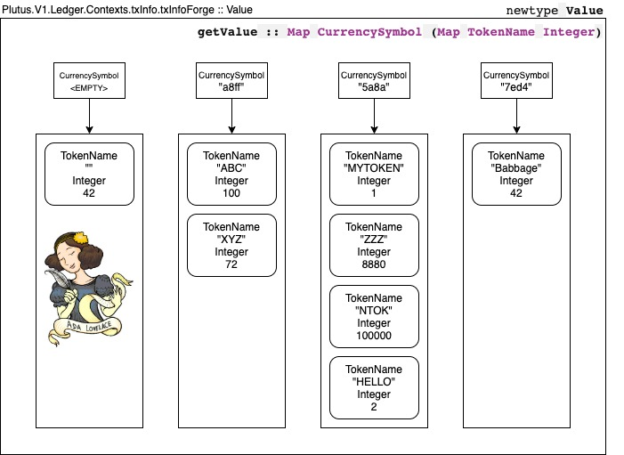
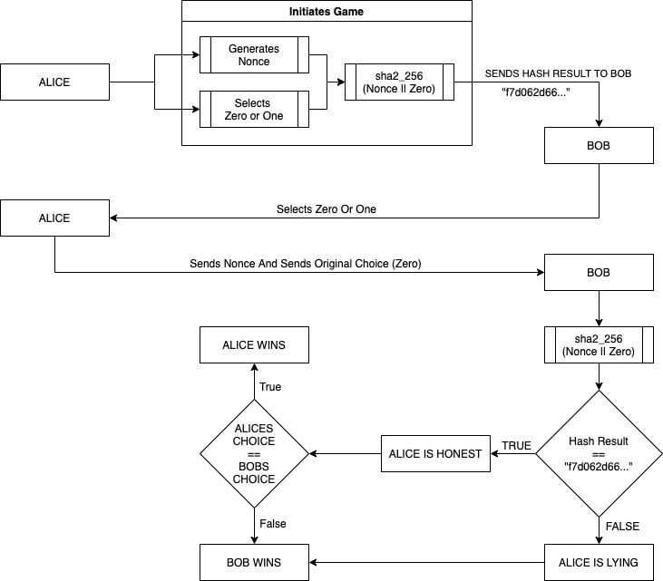

# Plutus Pioneer Program Lecture Notes - README

### **The Second Cohort Of The Plutus Pioneer Program**

A Quick Note

My intention insofar as bringing up ANYTHING within these notes is almost entirely for my own educational benefit. I am, in essence, exploring my thoughts through the written medium. However, if anybody would care to critique my thoughts, such feedback is appreciated more than you may know! It's welcomed, in fact! I am of the opinion that "a foolish consistency is the hobgoblin of little minds" and that to "fall into the vulgar mistake of dreaming I am persecuted when I am contradicted" is a fairly abhorrent trait. Thus, any feedback from ANYBODY is very much appreciated. Please be as blunt and as forthcoming as you wish.

*I am essentially trying to grabble with some of these issues individually and I do regret not facilitating the confidence to take more of an active role within the second cohort of the PPP whilst it was being run, which may be why you see me as more active now, than then.*

Progress, Current Projects, Goals and Declarations.

**Currently Working On: Learning Haskell From First Principles.**

**Goals:**

* Publish My Own Computation & Functional Programming Learning Materials And Notes.
* Finish Lecture Notes On Remaining Lectures.
* Re-Implement All Homework From L1 to L10.
* Work On Catalyst Proposal For Next Funding Iteration (See Proposal In Repo).

<small>

*Notes: Towards the end of the second cohort, I had to take some time away. The intention is to catch up to the end of the program now. Any lecture notes published within 'haskell-notes' are learning materials INSPIRED BY the Computation & FK course at the University of Edinburgh (and the various books outlined as resources by the course) which I am watching online.* ***THEY WILL NOT CONTAIN SOLUTIONS TO PROBLEM SETS.*** *If anyone has any concerns, <a href="mailto: jon@dilworth.dev">please contact me</a>.*

</small>

Quotes Of Note.

>"Anyone not shocked by quantum mechanics has not yet understood it."  
> — Niels Bohr

> "Plutus Platform Learning is Difficult"  
> — Lars Brünjes

> “Any fool can know. The point is to understand.”  
> — Albert Einstein

>"If you want to get money, you have to consume an output that is laying around and in turn you get more outputs."  
> — Michael Peyton-Jones

> "Haskell is useless"  
> — Simon Peyton Jones

> "Us geeky Haskell guys started with a completely useless language, in the end a program with no effect, there is no point in running it is there? You have this black box, you press go and it gets hot! There's no output, why did you run the program? The reason you run a program is to have an effect! But, nevertheless, we put up with that embarrassment for many years!"  
> — Simon Peyton Jones

> “To imagine a language is to imagine a form of life.”  
> — Ludwig Wittgenstein

>"It might be true that there are six billion people in the world and counting. Nevertheless, what you do makes a difference. It makes a difference, first of all, in material terms. It makes a difference to other people and it sets an example."  
> ― Robert Solomon, Waking Life

> “Unless you try to do something beyond what you have already mastered you will never grow.”  
> — Ralph Waldo Emerson

> "Constraints Liberate, Liberties Constrain"  
> — Runar Bjarnason

### 1. Authors Note

I have decided to begin making notes and documenting all lectures and exercises found within the Plutus Pioneer Program (cohort two). The writing style will be two-fold: technical but creative. The choice of style is for numerous reasons. Firstly, writing does aid the cognitive ability to solve problems [[1]](#1). In addition, Plutus is a new platform, Plutus-core is a new language, Haskell is somewhat unique, and understanding aspects of how this whole system fits together requires an element of creative thinking and problem-solving. Similarly, these technologies [1](#fn1) are novel in nature; as such, it may be a requirement to do some creative writing to explore new potential ideas.

Let it be known that it's not about money, although most people would disagree (this is one of the reasons why I feel somewhat at home within the Cardano community). It's about technology and, ultimately: changing the world. It's a strange thought: we are individuals, we have choices, and if we decide to do so, we can make a real difference here. If there is anything worth pursuing, it's making a difference. This is why I decided to devote as much time as possible to the difficult task of participating within the Plutus Pioneer Program and brushing up on Haskell.

**I would like to express my gratitude to IOHK for constructing this program and accepting me as a candidate. Furthermore, I would like to thank my family for their continual support in my efforts to pursue a career path that isn't thought to be conventional.**

I believe I can speak for the entire community when I extend my sincerest thanks to the world-class engineers and scientists who have contributed to building Cardano as of current. Charles, you are and will continue to be an inspiration to us. I hope we can all collectively strive to make positive societal change.

### 2. Preface

This set of notes, written in a casual, formal, yet creative style, has been cultivated by participating within the second cohort of the [Plutus Pioneer Program](https://testnets.cardano.org/en/plutus-pioneer-program/). I felt it necessary to document my own experience with the program to gain the most from it. Furthermore, I hope the notes found herein will help other aspiring developers for the time to come. Any contributions by others are encouraged.

To be completely honest, I'm not hugely qualified to write any of this! This is why I would hugely appreciate any corrections via contribution. I do, however hold the following qualifications:

* A First Class Honours Degree in Computer Science from the University of Manchester.
* A Postgraduate Diploma in Artificial Intelligence / Informatics from the University of Edinburgh. I hope to return to write my thesis on this subject after COVID-19 has 'blown over' to get my MSc (finally).

*Note: I hold a good few years of experience developing web applications in the industry. Not exactly what you would call academic.*

I am writing this set of notes in an ad-hoc style manner. As the lectures are released, I am doing my best to keep up with work, follow the classes, implement the homework, and keep these detailed notes.

### 3. Foreword

*To any and all IOHK employees: feel free to contribute by adding a foreword via a pull request.*

### 4. Formatting

The format for each set of lecture notes will follow a pseudo-technical specification. Thus, each set of notes should follow a template, making it easier for readers to break down and understand. Each set of notes will be presented in accordance with the following schema:

* Introductory Lecture Information
* Incremental Sections (1. → N.)
* Subsections (1.1 → N.X)
* Possible *Coffee Time* Sections — Thought Experiments, or Exercises (These Will Be Italicised) and will be specified as 'COFFEE TIME!'
* End Of Section Notes — Optional, Only If Required
* Exercises and Associated Comments
* Questions and Comments on Possible Problems (Things I May Be Uncertain Of)
* Lecture Summary

I will be doing my best to keep to the above schema for each set of notes, but this isn't a publishable book or formal technical documentation, so expect a degree of variance in style.

*Note: both footnotes and references will be used within this document set, which may seem confusing at times. However, please be aware that footnotes are formatted as enumerated superscript values, whereas footnotes are enumerated bracketed values.*

*Quotes: You will see various quotes throughout the text, this is simply how I like to write.*

### 5. Content Within This Repo

The contents of this repo are two-fold. Firstly (and most importantly), the content is a set of pseudo-academically written notes for the [Plutus Pioneer Program](https://testnets.cardano.org/en/plutus-pioneer-program/) [[3]](#3), which follow the formatting outlined in §5. Secondly, a collection of academic papers I have deemed to be of most significant importance **to me** is also provided. In addition, these papers will (slowly but surely) be printed out, annotated and scanned. Shortly thereafter, these scans will be re-uploaded to this repo.

This repo will **forever (and always)** remain open unless instructed otherwise by a member of the Cardano organisation or by an employee of IOHK.

### 6. Intended Audience

These notes are for anybody and everybody (somewhat vague, I know), but the audience could range from those who are:

* Current Plutus Pioneers.
* Individuals who are just following the programme.
* Developers from other communities.
* Even legislators (I highly doubt they would be reading my notes/documentation on Cardano).

But ultimately, we are all here for the same reason, we believe in what we're building, and the best way to approach adoption is to allow everybody to see what you're doing; at least, that would be my intuition.

**TLDR:** The intended audience is those looking to develop on Cardano.

### 7. Why These Notes May Be Helpful

First and foremost, these notes are likely most helpful to me. You do not understand something unless you can explain it. So, if you can write it, you can explain something; whether or not that something is correct is another matter. I hope that most of what I write is accurate or that somebody reads it and corrects me (I encourage open collaboration). 

However, once I finish this program and have a firm grasp of Haskell (after meticulously writing and rewriting every set of lecture notes), this repo may be hugely beneficial to other people. That is the aim of this project.

### 8. Contributing

*Anyone is free to contribute via a pull request.*

### 9. Table of Contents

 - [Lecture One](1-Lecture-One.md): BTC: UTxO and Cardanos' EUTxO Model, Local Plutus Playground, Compiling Smart Contracts
 - [Lecture Two](2-Lecture-Two.md): EUTxO Catch Up, Redeemers, Context, Datum, Data Type: Data, More Smart Contracts
 - [Lecture Three](3-Lecture-Three.md): Problems in the Playground, EUTxO Refresh, TxInfo & ScriptPurpose, On-Chain, Off-chain, Time, Examples
 - [Lecture Four](4-Lecture-Four.md): Monads, The EmulatorTrace Monad, Contract Monad, Homework
 - [Lecture Five](5-Lecture-Five.md): EUTxO Values, Plutus: Native Tokens (Minting and Burning)
 - [Lecture Six](6-Lecture-Six.md): Oracles, Core module, Swap module, Funds Module, Test Module, PAB & Front-ends
 - [Lecture Seven](7-Lecture-Seven.md): Committal Schemes, State Machines, Maintaining State Using Datum, NFTs and 'Thread' 
 - [Lecture Eight](): More State Machines? And Testing... *Nope! Not Yet Quite There...* '-'
 - [Lecture Nine](): Marlowe (Domain Specific Language for Cardano) '-'
 - [Lecture Ten](): '-'

*Note: Currently Unwritten Notes are Marked With '-' unless stated otherwise.*

### 10. Summary

As an accepted candidate for the second cohort (my first cohort e-mail landed in my junk mail), I have decided to write a set of notes for every lecture in the hope that it will help me learn, but in addition, it will help others. Although these are not strictly technical notes, there is some creative flair (at least I would like to think so), so you may even enjoy the read. I have a few years of experience in industry as a web developer, software engineer and machine learning engineer. I got my UG @ the University of Manchester and my PG @ the University of Edinburgh. Formatting is supposed to be (be isn't hugely) consistent. My intended audience is mainly other Plutus Pioneers or those who wish to learn outside the program. Anyone is free to contribute, and feel free to flick through each lecture as is listed above.

### 11. Nomenclature

* UTxO: A model of accounting used to identify how much 'money' (in this case: a digital 'currency') any 'wallet' has access to (in the context of 'cryptocurrencies'<a href="#fn1">1</a>.
* EUTxO: An extended model of UTxO. The fundamentals remain the same. Thus, transactions are made up of inputs, which themselves are unspent transaction outputs. However, there are some modifications to the model which are important. These modifications allow for more general transactions through the use of arbitrary logic [[8]](#8).
* Cardano-node: syncs to the Cardano Blockchain and talks between all of the Cardano subcomponents. It doesn't have to be set up as a stake pool, however, it is possible to set up a stake pool. It may be a core component for facilitating PoS consensus through the operation of a <code>pool</code>. It is important to note that others can delegate to a <code>pool</code>, but as of right now, will not earn the same kind of annual RoA (return on ada) as an operator.
* cardano-cli: command line interface for Cardano.
* cardano-wallet: HTTP server and command line for managing on-chain UTxOs.
* cardano-db-sync: postgreSQL for storing blocks and transactions.
* cardano-graphql: similar to FB api, it's easy to understand why. You have a load of wallets with keys in them (think of these as 'people' - they're not though, they're wallets) and you have a bunch of connections between them called Unspent Transaction Outputs. You also have a load of transactions, so a graph seems like an appropriate data structure to me to represent this kind of data (wallets and Txs are nodes, UTxOs are edges).
* cardano-rosetta: DevOps for Blockchain.
* cardano-addresses: for backing up wallets (key phrases) - a module.
* cardano-ledger-specs: formal specification for current release.
* bech32: Haskell implementation of bech32.
* smash: powers SPOs - metadata aggregation server and keeps track of whos staking what.
* ouroboros-network: they used fancy words, I'm just going to call this the Cardano Blockchain Consensus Algorithm. 
* Plutus-Platform: an application development platform for developing distributed applications using the Cardano blockchain [[5]](#5).
* Compiler: A compiler takes some source code, and produces an output in another language, while the retaining meaning of the source. <code>Source -> (analysis) -> Compiler -> (Synthesis) -> Target.</code> [[4]](#4)
* plutus-tx: The compiler which is responsible for transforming Plutus (which is a subset of Haskell) into Plutus-core [[6]](#6).
* plutus-core: What high level languages are to assembly language, Plutus is to Plutus-core [[7]](#7). From what I understand, plutus-core is essentially: System F omega with (equi-)recursive types.
* AssetClass: A native token that exists on the Cardano blockchain.
* Minting: the process of creating a set of native tokens or an NFT.
* Burning: the process of destroying a native token.
* Bytestring: A datatype which may contain 8bit bytes.
* XOverloadStrings: A Haskell setting that allows a Bytestring to contain a String literal.

*More Items Are Continued To Be Added As Time Elapses.*

### 12. StackExchange (Cardano) Answers:

1. [What exactly is a redeemer?](https://cardano.stackexchange.com/questions/471/what-exactly-is-a-redeemer/2208#2208)
2. [How to compile plutus source code locally?](https://cardano.stackexchange.com/questions/2346/how-to-compile-plutus-source-code-locally/2354#2354)

### 13. References

<a href="#1" id="1">[1]</a>
Kellogg, R.T., 1999.  
The psychology of writing.  
Oxford University Press.  

<a href="#2" id="2">[2]</a>
Jones, M.P., 2021.  
Plutus Tx: compiling Haskell into Plutus Core. Viewed 2nd August 2021.  
<https://iohk.io/en/blog/posts/2021/02/02/plutus-tx-compiling-haskell-into-plutus-core/>  

<a href="#3" id="3">[3]</a>
The Cardano Foundation, July 2021.  
Input Output Hong Kong (IOHK).  
<small>Last Updated: Early July 2021.</small>  
<https://testnets.cardano.org/en/plutus-pioneer-program/>  

<a href="#4" id="4">[4]</a>
Jonathon Dilworth, 18 May 2015.  
The University of Manchester Alumni.  
<small>Last Updated: 7 August 2021. </small>  
<https://github.com/jonathondilworth/compilers>  

<a href="#5" id="5">[5]</a>
IOHK GitHub.  
Input Output Hong Kong (IOHK).  
<https://github.com/input-output-hk/plutus>  

<a href="#6" id="6">[6]</a>
IOHK GitHub.  
Input Output Hong Kong (IOHK).  
<https://github.com/input-output-hk/plutus/tree/master/plutus-tx>  

<a href="#7" id="7">[7]</a>
IOHK GitHub.  
Input Output Hong Kong (IOHK).  
<https://github.com/input-output-hk/plutus/tree/master/plutus-core>  

<a href="#8" id="8">[8]</a>
Chakravarty, M.M., Chapman, J., MacKenzie, K., Melkonian, O., Jones, M.P. and Wadler, P., 2020, February.   
The extended UTXO model.  
In International Conference on Financial Cryptography and Data Security (pp. 525-539). Springer, Cham.  

<a href="#9" id="9">[9]</a>
Rabai, B.A., 2015.  
Programming Language Use in US Academia and Industry.  
Informatics in Education, 14(2), pp.143-160.  

### 14. Footnotes

<a id="fn1">1.</a> The technologies I am referencing are Distributed Ledgers and Blockchain Consensus Algorithms — 'cryptocurrencies'.

### 15. Appendix A

15.1: Plutus-Platform: The 'on-chain' and 'off-chain' portion of Cardano's smart(er) contract implementation (from this point onwards, smart contracts simply refer to the extended UTxO model that implements Plutus). This facilitates smart contract transactions (which may be complex in nature) using off-chain code (implemented in 'raw' Haskell, plus some libraries made available via Cardano. *note: it does not require compiling to Plutus-core*). Off-chain code performs transactional validation checks (some of which are time-based) to ensure any such transaction can be legitimately executed (or the UTxO can be 'spent,' or as it were, 'not-spent'). Furthermore, on-chain code performs the execution of transaction via active nodes operating on the network (when prompted to) and writes to the (collective) Blockchain accordingly.

15.2: Contracts can remain 'stale' forever (if nobody changes their state by initiating a change of state at that 'script' or EUTxO address).

### 16. Appendix B: Images

**16.1: Plutus/V1/Ledger/Value.hs Constructor:**

 

**16.2: Committal Scheme:**

**I am proud to be part of this community. I look forward to what the future holds.**

### 17. Appendix: Additional Tables

*In Progress*

 

### 18. Appendix: Additional Literature

*In Progress*

 

### 19. TODO

1. Correct any errors within any of my current lecture notes.
2. Continue to include references and footnotes within all lecture notes.
3. Restructure lecture notes to reflect format in §4.
4. Catch up to and finish Lecture Ten ASAP.
5. Continue to work on Plutus Public Test Net.
6. Continue to work on submission for Catalyst.

*Work On Developing My Own Haskell Notes Too (in haskell-notes)*

<small>**A Final Note From The Author: My Sincerest Thanks**</small>

<small>*Having these notes featured in two of the e-mails sent out for the pioneers meant* ***A LOT*** *to me (during a difficult time of my life). My thanks go out all individuals associated with IOHK who have provided such an amazing degree of encouragement.*</small>

<small>***This technology and this community has changed my life.***</small>
s