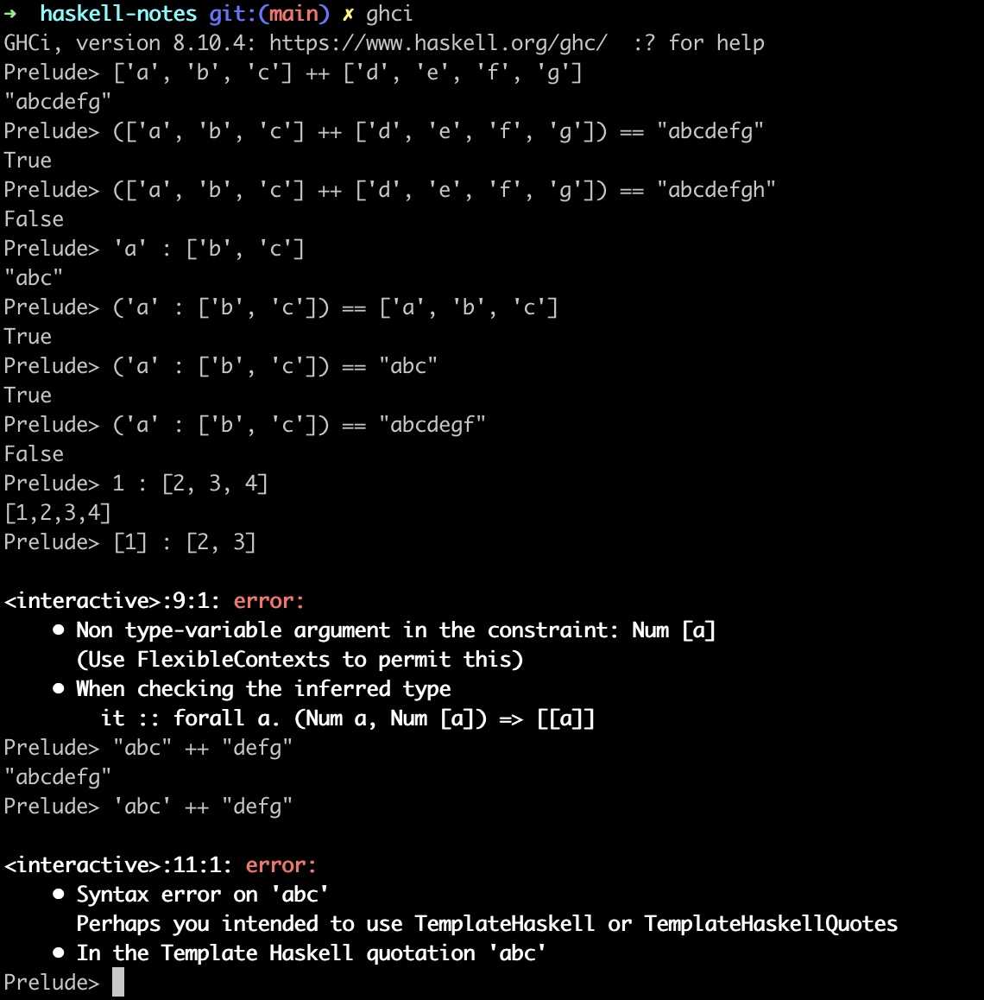

# FP Lecture Notes 2

*Topic: Lists & Recursion*

### 1. Introduction

Within any given introduction, I'll try and briefly recap what was expressed within the last set of notes (it was list comprehensions, which are in the form: <code>[ x | x <- [1..10] ]</code>, we also visited some geeky nomenclature and **most importantly, WE HAD FUN!**).

*TODO: Finish Introduction, You Should Write This Last.*

### 2. More On LISTS

Two additional operations that must be taken note of: **cons** and **append**:

* Cons takes an element and a list as parameters: <code>(:) :: a -> [a] -> [a]</code>
* Append takes two lists as parameters: <code>(++) :: [a] -> [a] -> [a]</code>

>*Coffee Time! Can you name what kind of data structure is returned by both Cons and Append? Discuss amongst yourselves (or if you're like me, in your head!) what these functions may or may not do!*

  
Enjoyed Your Coffee? Me too! Hit this drop down menu to see the answers!

*Remember: There is no such thing as a silly question!*

***This is to say: Do not be afraid to be wrong. Do not be afraid to ask questions.***

#### Answers
1. A list data structure is returned by both cons and append. Remember Strings are lists of characters too ([Char] == String, such that: ['a','b','c'] == "abc" ... **BE CAREFUL THOUGH! Single quotes are for characters, double quotes are for strings.**
2. What do these functions do?
 * Con <code>:</code> Recall: the first param is a singular element, whereas the second is a list of elements.
 * Append <code>++</code> does a beautiful job of concatenating two lists together, such that: <code>([1,2,3] ++ [4,5,6]) == [1,2,3,4,5,6]</code>

### 2.1 Examples

	
Click Here To See Examples of <code>:</code> and <code>++</code>

Notice the distinctions as to when and where you can use these operators (in regards to lists and elements).

### 3. The Best Way To Design Programs?

Right, even though this is an undergraduate level course, I don't expect many undergraduates to stumble across these notes unless they're taking Blockchains and Distributed Ledgers.

With that said, I almost feel like Haskell is 